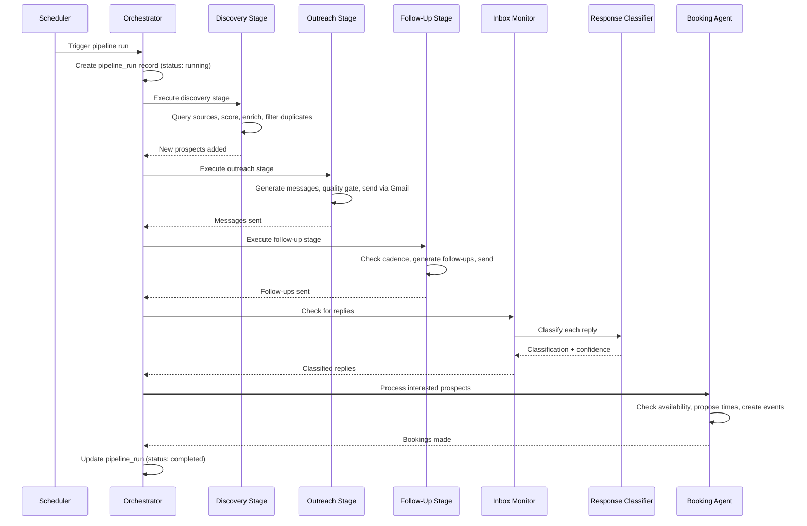

# Design Document: Automated Calendar Pipeline

## Overview

The Automated Calendar Pipeline extends SignalFlow from a manually-driven GTM tool into an autonomous outreach engine. It introduces a background Pipeline Orchestrator that coordinates prospect discovery, personalized email outreach, follow-up sequences, AI-powered response classification, and automated meeting booking — all running on a configurable schedule without founder intervention.

The system builds on the existing Next.js + Postgres + OpenAI stack and integrates with Google APIs (Gmail for sending/receiving, Google Calendar for availability/booking) via OAuth 2.0. It reuses the existing scoring, enrichment, throttle, message generation, and CRM services, extending them with new pipeline-specific tables and services.

### Key Design Decisions

1. **Database-backed job queue**: Pipeline runs are scheduled via a lightweight in-process scheduler (`node-cron`) that triggers API route calls. Each run is persisted as a `pipeline_run` row, enabling status tracking, failure recovery, and idempotent retries without external queue infrastructure.
2. **Polling-based inbox monitoring**: Rather than relying on Gmail push notifications (which require a public webhook and Pub/Sub setup), the pipeline polls for new replies during each pipeline run using Gmail API's `messages.list` with `after` timestamp filtering. This keeps infrastructure simple for an MVP.
3. **Google APIs client library (`googleapis`)**: Used for both Gmail and Calendar OAuth 2.0 flows, token management, email sending, inbox reading, availability checking, and event creation.
4. **AI-powered response classification**: OpenAI GPT classifies incoming replies into categories (interested, not_interested, objection, question, out_of_office) with a confidence score. Low-confidence classifications are flagged for manual review.
5. **Staggered sending with jitter**: Outreach sends are spaced with randomized delays (30–120s) to avoid spam filter triggers, implemented as sequential processing within a pipeline run.
6. **Quality gates as pure validation functions**: Pre-send checks (personalization, word count, score threshold, duplicate detection, email validity) are implemented as composable pure functions, making them independently testable.
7. **Extend existing services**: The pipeline reuses `scoringService`, `enrichmentService`, `messageService`, `throttleService`, `outreachService`, and `crmService` rather than duplicating logic.

## Architecture

```mermaid
graph TD
    subgraph Client["Frontend (React / Next.js)"]
        PipelineDashboard[Pipeline Dashboard]
        PipelineConfig[Pipeline Configuration]
        ConversationView[Conversation Thread View]
        CalendarView[Calendar Week View]
        ManualReview[Manual Review Queue]
    end

    subgraph API["API Layer (Next.js API Routes)"]
        PipelineRoutes["/api/pipeline/*"]
        OAuthRoutes["/api/oauth/*"]
        ExistingRoutes["Existing API Routes"]
    end

    subgraph Services["Service Layer"]
        Orchestrator[Pipeline Orchestrator]
        Scheduler[Cron Scheduler]
        EmailService[Email Integration Service]
        CalendarService[Calendar Integration Service]
        ResponseClassifier[Response Classifier]
        BookingAgent[Booking Agent]
        QualityGate[Quality Gate Service]
        StrategyService[Strategy Service]
        ExistingServices["Existing Services<br/>(scoring, enrichment, message,<br/>throttle, outreach, CRM)"]
    end

    subgraph External["External Services"]
        GmailAPI["Gmail API"]
        CalendarAPI["Google Calendar API"]
        OpenAI["OpenAI GPT API"]
    end

    subgraph Data["Data Layer"]
        Postgres[(Postgres DB)]
    end

    PipelineDashboard --> PipelineRoutes
    PipelineConfig --> PipelineRoutes
    ConversationView --> PipelineRoutes
    CalendarView --> PipelineRoutes
    ManualReview --> PipelineRoutes

    PipelineRoutes --> Orchestrator
    OAuthRoutes --> EmailService
    OAuthRoutes --> CalendarService

    Scheduler --> Orchestrator
    Orchestrator --> EmailService
    Orchestrator --> CalendarService
    Orchestrator --> ResponseClassifier
    Orchestrator --> BookingAgent
    Orchestrator --> QualityGate
    Orchestrator --> StrategyService
    Orchestrator --> ExistingServices

    BookingAgent --> CalendarService
    BookingAgent --> EmailService
    ResponseClassifier --> OpenAI
    StrategyService --> ExistingServices

    EmailService --> GmailAPI
    CalendarService --> CalendarAPI

    Orchestrator --> Postgres
    EmailService --> Postgres
    CalendarService --> Postgres
    QualityGate --> Postgres
end
```

### Pipeline Run Flow



## Components and Interfaces

### 1. Pipeline Orchestrator Service

Coordinates all pipeline stages and manages run lifecycle.

```typescript
interface PipelineRun {
  id: string;
  founderId: string;
  status: 'running' | 'completed' | 'failed' | 'partial';
  stagesCompleted: string[]; // e.g. ['discovery', 'outreach', 'follow_up', 'inbox', 'booking']
  stageErrors: Record<string, string>; // stage -> error message
  prospectsDiscovered: number;
  messagesSent: number;
  repliesProcessed: number;
  meetingsBooked: number;
  startedAt: Date;
  completedAt?: Date;
}

interface PipelineStatus {
  state: 'running' | 'paused' | 'error';
  lastRun?: PipelineRun;
  nextRunAt?: Date;
}

// POST /api/pipeline/run      — manually trigger a pipeline run
// POST /api/pipeline/pause     — pause the orchestrator
// POST /api/pipeline/resume    — resume the orchestrator
// GET  /api/pipeline/status    — get current pipeline status
// GET  /api/pipeline/runs      — list recent pipeline runs
```

### 2. Pipeline Configuration Service

Manages all configurable pipeline parameters.

```typescript
interface PipelineConfig {
  founderId: string;
  runIntervalMinutes: number; // 15–240, default 60
  businessHoursStart: string; // HH:MM, default "09:00"
  businessHoursEnd: string; // HH:MM, default "17:00"
  businessDays: number[]; // 0=Sun..6=Sat, default [1,2,3,4,5]
  timezone: string; // IANA timezone, default "America/New_York"
  dailyDiscoveryCap: number; // 10–200, default 50
  minLeadScore: number; // 30–90, default 50
  maxFollowUps: number; // 1–5, default 3
  sequenceCadenceDays: number[]; // default [3, 5, 7]
  tonePreference: TonePreference; // default "professional"
  productContext: string;
  valueProposition: string;
  targetPainPoints: string[];
}

// GET  /api/pipeline/config    — get current config
// PUT  /api/pipeline/config    — update config
```

### 3. Email Integration Service

Handles Gmail OAuth, sending, and inbox monitoring.

```typescript
interface EmailConnection {
  id: string;
  founderId: string;
  email: string;
  provider: 'gmail';
  accessToken: string; // encrypted at rest
  refreshToken: string; // encrypted at rest
  tokenExpiresAt: Date;
  sendingName: string;
  emailSignature: string;
  isActive: boolean;
  lastSyncAt?: Date;
  createdAt: Date;
}

interface IncomingReply {
  id: string;
  founderId: string;
  leadId: string;
  outreachRecordId: string; // the outreach message this replies to
  gmailMessageId: string;
  gmailThreadId: string;
  fromEmail: string;
  subject: string;
  bodyText: string;
  receivedAt: Date;
  classificationResult?: string;
  classificationConfidence?: number;
  requiresManualReview: boolean;
  processedAt?: Date;
}

// GET  /api/oauth/gmail/authorize   — initiate OAuth flow
// GET  /api/oauth/gmail/callback    — handle OAuth callback
// GET  /api/pipeline/email/status   — connection status
// DELETE /api/pipeline/email        — disconnect email
```

### 4. Calendar Integration Service

Handles Google Calendar OAuth, availability checking, and event creation.

```typescript
interface CalendarConnection {
  id: string;
  founderId: string;
  calendarId: string; // Google Calendar ID
  provider: 'google';
  accessToken: string; // encrypted at rest
  refreshToken: string; // encrypted at rest
  tokenExpiresAt: Date;
  isActive: boolean;
  createdAt: Date;
}

interface AvailabilityWindow {
  founderId: string;
  dayOfWeek: number; // 0=Sun..6=Sat
  startTime: string; // HH:MM
  endTime: string; // HH:MM
  timezone: string;
}

interface TimeSlot {
  start: Date;
  end: Date;
}

interface CalendarEvent {
  id: string;
  calendarEventId: string; // Google Calendar event ID
  founderId: string;
  leadId: string;
  title: string;
  description: string;
  startTime: Date;
  endTime: Date;
  attendeeEmail: string;
  createdAt: Date;
}

// GET  /api/oauth/calendar/authorize   — initiate OAuth flow
// GET  /api/oauth/calendar/callback    — handle OAuth callback
// GET  /api/pipeline/calendar/status   — connection status
// GET  /api/pipeline/calendar/slots    — available slots for next 7 days
// DELETE /api/pipeline/calendar        — disconnect calendar
```

### 5. Response Classifier Service

AI-powered classification of incoming prospect replies.

```typescript
type ResponseClassification =
  | 'interested'
  | 'not_interested'
  | 'objection'
  | 'question'
  | 'out_of_office';

interface ClassificationResult {
  classification: ResponseClassification;
  confidence: number; // 0.0–1.0
  reasoning: string; // LLM explanation
  detectedReturnDate?: Date; // for out_of_office
}

// Internal service — no direct API routes
// Called by Orchestrator during inbox processing stage
```

### 6. Booking Agent Service

Negotiates meeting times and creates calendar events.

```typescript
interface BookingProposal {
  id: string;
  leadId: string;
  founderId: string;
  proposedSlots: TimeSlot[]; // up to 3 slots
  status: 'proposed' | 'confirmed' | 'declined' | 'expired';
  proposedAt: Date;
  respondedAt?: Date;
  confirmedSlot?: TimeSlot;
  followUpSentAt?: Date;
}

// Internal service — no direct API routes
// Called by Orchestrator when a prospect is classified as "interested"
```

### 7. Quality Gate Service

Pre-send validation checks implemented as pure functions.

```typescript
interface QualityCheckResult {
  passed: boolean;
  failures: QualityFailure[];
}

interface QualityFailure {
  check: string;
  reason: string;
}

// Quality checks:
// 1. hasPersonalization(message, enrichmentData) — at least one enrichment element
// 2. withinWordLimit(message, channel) — 150 for DM, 250 for email
// 3. meetsScoreThreshold(leadScore, minScore) — configurable minimum
// 4. noDuplicateWithin24h(leadId, channel) — no same-channel message in 24h
// 5. hasValidEmail(lead) — valid email address present
// All checks are pure functions composable into a single gate
```

### 8. Strategy Service

Manages niche-adaptive outreach strategy inputs.

```typescript
interface OutreachStrategy {
  productContext: string;
  valueProposition: string;
  targetPainPoints: string[];
  tonePreference: TonePreference;
}

// Stored as part of PipelineConfig
// Passed to messageService.generateMessage() for each outreach
```

### 9. Pipeline Dashboard & Monitoring

Extends the existing dashboard with pipeline-specific views.

```typescript
interface PipelineMetrics {
  prospectsDiscoveredToday: number;
  messagesSentToday: number;
  repliesReceivedToday: number;
  meetingsBookedToday: number;
  replyRatePercent: number;
  pipelineStatus: PipelineStatus;
}

interface ConversationThread {
  leadId: string;
  leadName: string;
  company: string;
  messages: ConversationMessage[];
}

interface ConversationMessage {
  id: string;
  direction: 'outbound' | 'inbound';
  content: string;
  timestamp: Date;
  classification?: ResponseClassification;
  confidence?: number;
}

interface ManualReviewItem {
  replyId: string;
  leadName: string;
  company: string;
  replyText: string;
  suggestedClassification: ResponseClassification;
  confidence: number;
  receivedAt: Date;
}

// GET  /api/pipeline/metrics          — daily pipeline metrics
// GET  /api/pipeline/conversations    — list all conversation threads
// GET  /api/pipeline/conversations/:leadId — single thread
// GET  /api/pipeline/review           — manual review queue
// POST /api/pipeline/review/:replyId  — resolve a manual review item
// GET  /api/pipeline/calendar/week    — current week calendar with bookings
```

## Data Models

### New Tables Entity-Relationship Diagram

```mermaid
erDiagram
    FOUNDER ||--o| PIPELINE_CONFIG : configures
    FOUNDER ||--o{ PIPELINE_RUN : executes
    FOUNDER ||--o| EMAIL_CONNECTION : connects
    FOUNDER ||--o| CALENDAR_CONNECTION : connects
    FOUNDER ||--o{ AVAILABILITY_WINDOW : defines
    LEAD ||--o{ INCOMING_REPLY : receives
    LEAD ||--o{ BOOKING_PROPOSAL : has
    LEAD ||--o{ CALENDAR_EVENT : has
    OUTREACH_RECORD ||--o{ INCOMING_REPLY : repliesTo

    PIPELINE_CONFIG {
        uuid id PK
        uuid founder_id FK
        int run_interval_minutes
        varchar business_hours_start
        varchar business_hours_end
        int[] business_days
        varchar timezone
        int daily_discovery_cap
        int min_lead_score
        int max_follow_ups
        int[] sequence_cadence_days
        varchar tone_preference
        text product_context
        text value_proposition
        text[] target_pain_points
        timestamp created_at
        timestamp updated_at
    }

    PIPELINE_RUN {
        uuid id PK
        uuid founder_id FK
        varchar status
        text[] stages_completed
        jsonb stage_errors
        int prospects_discovered
        int messages_sent
        int replies_processed
        int meetings_booked
        timestamp started_at
        timestamp completed_at
    }

    EMAIL_CONNECTION {
        uuid id PK
        uuid founder_id FK
        varchar email
        varchar provider
        text access_token
        text refresh_token
        timestamp token_expires_at
        varchar sending_name
        text email_signature
        boolean is_active
        timestamp last_sync_at
        timestamp created_at
    }

    CALENDAR_CONNECTION {
        uuid id PK
        uuid founder_id FK
        varchar calendar_id
        varchar provider
        text access_token
        text refresh_token
        timestamp token_expires_at
        boolean is_active
        timestamp created_at
    }

    AVAILABILITY_WINDOW {
        uuid id PK
        uuid founder_id FK
        int day_of_week
        varchar start_time
        varchar end_time
        varchar timezone
    }

    INCOMING_REPLY {
        uuid id PK
        uuid founder_id FK
        uuid lead_id FK
        uuid outreach_record_id FK
        varchar gmail_message_id
        varchar gmail_thread_id
        varchar from_email
        varchar subject
        text body_text
        timestamp received_at
        varchar classification_result
        float classification_confidence
        text classification_reasoning
        timestamp detected_return_date
        boolean requires_manual_review
        timestamp processed_at
        timestamp created_at
    }

    BOOKING_PROPOSAL {
        uuid id PK
        uuid lead_id FK
        uuid founder_id FK
        jsonb proposed_slots
        varchar status
        timestamp proposed_at
        timestamp responded_at
        jsonb confirmed_slot
        timestamp follow_up_sent_at
        timestamp created_at
    }

    CALENDAR_EVENT {
        uuid id PK
        varchar calendar_event_id
        uuid founder_id FK
        uuid lead_id FK
        varchar title
        text description
        timestamp start_time
        timestamp end_time
        varchar attendee_email
        timestamp created_at
    }
```



### Schema Extensions

The following tables extend the existing schema. The existing `lead`, `outreach_record`, `status_change`, and `throttle_config` tables remain unchanged — the pipeline reuses them directly.

Key additions to the `outreach_record` table via a new column:

- `gmail_thread_id VARCHAR(255)` — links sent messages to Gmail threads for reply matching
- `gmail_message_id VARCHAR(255)` — unique Gmail message identifier

Key additions to the `lead` table via a new column:

- `email VARCHAR(255)` — prospect's email address (required for automated outreach)
- `discovery_source VARCHAR(100)` — where the prospect was discovered
- `discovered_at TIMESTAMPTZ` — when the prospect was discovered by the pipeline

### Postgres Schema Notes

- **OAuth tokens**: `access_token` and `refresh_token` are stored encrypted using AES-256-GCM with a server-side encryption key from environment variables. The encryption/decryption is handled at the service layer.
- **Gmail thread matching**: `gmail_thread_id` on `outreach_record` enables matching incoming replies to the original outreach message. The `incoming_reply` table references the `outreach_record_id` for full thread reconstruction.
- **Availability windows**: Stored as individual rows per day-of-week, allowing founders to set different hours for different days. The default seed creates Mon–Fri 9:00–17:00 entries.
- **Pipeline run metrics**: Aggregate counts (`prospects_discovered`, `messages_sent`, etc.) are denormalized on the `pipeline_run` row for fast dashboard queries.
- **Indexes**: On `incoming_reply(gmail_thread_id)` for reply matching, on `pipeline_run(founder_id, started_at DESC)` for recent runs, on `booking_proposal(lead_id, status)` for active proposals, on `lead(email)` for email-based lookups.

## Correctness Properties

_A property is a characteristic or behavior that should hold true across all valid executions of a system — essentially, a formal statement about what the system should do. Properties serve as the bridge between human-readable specifications and machine-verifiable correctness guarantees._

### Property 1: Next run time scheduling

_For any_ pipeline configuration with a run interval `I` minutes, business hours `[start, end]`, business days set `D`, and a current timestamp `T`: the computed next run time SHALL be the earliest time `T' > T` such that `T'` falls within business hours on a business day and `T' - lastRunTime >= I` minutes. If `T` is outside business hours, `T'` SHALL be the start of the next business-hours window.

**Validates: Requirements 1.1**

### Property 2: Stage failure resilience

_For any_ pipeline run and any subset of stages that throw errors, the orchestrator SHALL complete all non-failing stages and the `stagesCompleted` array SHALL contain exactly the stages that did not fail, while `stageErrors` SHALL contain entries for exactly the stages that failed.

**Validates: Requirements 1.4**

### Property 3: Score threshold filtering

_For any_ lead score `S` and configurable minimum threshold `T` (where `T` is in [30, 90]), the pipeline SHALL include the lead in the outreach queue if and only if `S >= T`. Leads with `S < T` SHALL be excluded.

**Validates: Requirements 2.2, 10.3**

### Property 4: Daily discovery cap enforcement

_For any_ number of available prospects `N` and configurable daily cap `C` (where `C` is in [10, 200]), the number of prospects added to the lead list in a single day SHALL be at most `C`, even when `N > C`.

**Validates: Requirements 2.4**

### Property 5: Outreach prompt completeness

_For any_ outreach message generation, the constructed prompt SHALL contain the founder's product context, the prospect's enrichment data elements (when available), and the prospect's industry context. For follow-up messages, the prompt SHALL additionally contain all previous messages in the conversation thread.

**Validates: Requirements 3.3, 5.3**

### Property 6: Stagger delay bounds

_For any_ computed inter-message delay during automated outreach sending, the delay SHALL be in the range [30, 120] seconds inclusive.

**Validates: Requirements 4.6**

### Property 7: Follow-up cadence timing

_For any_ prospect with a last-message timestamp `L` and a configured cadence interval `D` days for the current follow-up number, a follow-up SHALL be due if and only if the current time `T` satisfies `T - L >= D` days and the prospect has not replied.

**Validates: Requirements 5.1**

### Property 8: Maximum follow-ups cap

_For any_ prospect with `F` follow-ups already sent and a configured maximum `M` (where `M` is in [1, 5]), the pipeline SHALL send a follow-up if and only if `F < M`. When `F >= M` and no reply has been received, the prospect's CRM status SHALL be set to "Closed".

**Validates: Requirements 5.2, 5.5**

### Property 9: Response classification validity

_For any_ reply text processed by the Response Classifier, the returned classification SHALL be exactly one of: `interested`, `not_interested`, `objection`, `question`, or `out_of_office`. The confidence score SHALL be in the range [0.0, 1.0].

**Validates: Requirements 6.1**

### Property 10: Low-confidence manual review threshold

_For any_ classification result with confidence score `C`, the reply SHALL be flagged for manual review (and no automated action taken) if and only if `C < 0.7`.

**Validates: Requirements 6.7**

### Property 11: Booking proposal slot count

_For any_ set of available time slots of size `N`, the booking proposal SHALL contain exactly `min(N, 3)` slots. The proposal SHALL never contain more than 3 slots.

**Validates: Requirements 7.2**

### Property 12: Proposed slots within availability windows

_For any_ set of proposed meeting time slots and the founder's configured availability windows, every proposed slot SHALL fall entirely within an availability window — that is, the slot's day-of-week is in the configured business days and the slot's start and end times are within the configured time range for that day.

**Validates: Requirements 7.7**

### Property 13: Available slots computation

_For any_ set of existing calendar events (with busy/free status) and a query time range, the computed available slots SHALL be exactly the time periods within the range that do not overlap with any busy event. No available slot SHALL overlap with a busy event, and no free period SHALL be missing from the result.

**Validates: Requirements 8.3**

### Property 14: Reply thread matching

_For any_ set of inbox messages with Gmail thread IDs and a set of outreach records with Gmail thread IDs, the reply matching function SHALL pair an inbox message to an outreach record if and only if their `gmail_thread_id` values are equal. Unmatched inbox messages (no corresponding outreach record) SHALL be ignored.

**Validates: Requirements 9.4**

### Property 15: Email signature appending

_For any_ outreach message body `M` and configured email signature `S` (non-empty), the composed message sent via the Email Integration SHALL end with the signature `S` appended after the message body.

**Validates: Requirements 9.6**

### Property 16: Quality gate — personalization check

_For any_ outreach message text and prospect enrichment data, the personalization quality gate SHALL pass if and only if the message contains at least one element from the prospect's enrichment data (LinkedIn bio snippet, recent post reference, or company info reference).

**Validates: Requirements 10.1**

### Property 17: Quality gate — word count limit

_For any_ outreach message and channel type, the word count quality gate SHALL reject the message if and only if the word count exceeds the channel's limit (150 words for DM, 250 words for email).

**Validates: Requirements 10.2**

### Property 18: Quality gate — duplicate send prevention

_For any_ prospect, channel, and set of outreach records with timestamps, the duplicate quality gate SHALL reject a new send if and only if there exists an outreach record for the same prospect and channel with a timestamp within the last 24 hours.

**Validates: Requirements 10.5**

### Property 19: Quality gate — email validation

_For any_ string provided as a prospect's email address, the email validation quality gate SHALL pass if and only if the string matches a valid email format (contains exactly one `@`, has a non-empty local part and domain, and the domain contains at least one `.`).

**Validates: Requirements 10.7**

### Property 20: Pipeline metrics computation

_For any_ set of pipeline run records for a given day, the daily metrics SHALL satisfy: `prospectsDiscoveredToday` equals the sum of `prospects_discovered` across all runs that day, `messagesSentToday` equals the sum of `messages_sent`, `repliesReceivedToday` equals the sum of `replies_processed`, `meetingsBookedToday` equals the sum of `meetings_booked`, and `replyRatePercent` equals `(repliesReceivedToday / messagesSentToday) * 100` (or 0 when no messages sent).

**Validates: Requirements 11.2**

### Property 21: Conversation thread chronological order

_For any_ set of outbound and inbound messages for a prospect, the merged conversation thread SHALL be ordered chronologically by timestamp — for every consecutive pair, the earlier message's timestamp is less than or equal to the later message's timestamp.

**Validates: Requirements 11.3**

### Property 22: Pipeline configuration validation

_For any_ pipeline configuration input, the validator SHALL accept the input if and only if all of the following hold: `runIntervalMinutes` is in [15, 240], `dailyDiscoveryCap` is in [10, 200], `maxFollowUps` is in [1, 5], and `minLeadScore` is in [30, 90]. For each field outside its range, the validator SHALL return an error message specifying the allowed range.

**Validates: Requirements 12.4, 12.5**

## Error Handling

### Pipeline-Specific Error Strategy

All new API routes follow the existing error response pattern:

```typescript
interface ApiError {
  error: string;
  message: string;
  details?: Record<string, string>;
}
```

| Scenario                       | HTTP Status   | Error Code               | Behavior                                                         |
| ------------------------------ | ------------- | ------------------------ | ---------------------------------------------------------------- |
| Pipeline already running       | 409           | `PIPELINE_RUNNING`       | Returns current run ID; prevents concurrent runs                 |
| Pipeline paused, run requested | 400           | `PIPELINE_PAUSED`        | Instructs founder to resume first                                |
| Gmail OAuth token expired      | 401           | `EMAIL_TOKEN_EXPIRED`    | Pauses outreach, notifies founder to re-authenticate             |
| Calendar OAuth token expired   | 401           | `CALENDAR_TOKEN_EXPIRED` | Pauses booking agent, notifies founder to re-authenticate        |
| Gmail send failure             | 502           | `EMAIL_SEND_FAILED`      | Marks prospect as send_failed, retries next run (Req 4.5)        |
| Quality gate rejection         | 200           | N/A                      | Prospect skipped, rejection logged with reason (Req 10.6)        |
| Low-confidence classification  | 200           | N/A                      | Reply flagged for manual review, no automated action (Req 6.7)   |
| Config validation failure      | 400           | `VALIDATION_ERROR`       | Returns `details` with field names and allowed ranges (Req 12.5) |
| Stage failure during run       | 200 (partial) | N/A                      | Failed stage logged in `stageErrors`, run continues (Req 1.4)    |
| No email connected             | 400           | `EMAIL_NOT_CONNECTED`    | Instructs founder to connect email before starting pipeline      |
| No calendar connected          | 400           | `CALENDAR_NOT_CONNECTED` | Instructs founder to connect calendar before booking can work    |
| Discovery cap reached          | 200           | N/A                      | Remaining prospects queued for next day, logged                  |
| Throttle limit reached         | 200           | N/A                      | Remaining outreach queued for next day (Req 4.7)                 |

### OAuth Token Refresh Strategy

- The Email and Calendar Integration services attempt automatic token refresh using the stored `refresh_token` before each API call when the `access_token` is within 5 minutes of expiry.
- If refresh fails (e.g., user revoked access), the connection is marked `is_active = false`, the relevant pipeline stage is paused, and a notification is created for the founder.
- The founder re-authenticates via the OAuth flow, which updates the stored tokens and reactivates the connection.

### Pipeline Run Failure Recovery

- Each pipeline run processes stages sequentially. If a stage throws an unrecoverable error, the orchestrator catches it, records the error in `stage_errors`, and proceeds to the next stage.
- The run's final status is `partial` if any stage failed, `completed` if all succeeded, or `failed` if the orchestrator itself encountered a fatal error (e.g., database unavailable).
- Individual prospect-level failures within a stage (e.g., one email send fails) do not fail the entire stage — they are logged and the prospect is retried in the next run.

## Testing Strategy

### Unit Tests (Example-Based)

Unit tests cover specific scenarios, edge cases, and component behavior:

- **Pipeline pause/resume state transitions**: Verify pause completes current run, resume schedules next run (Req 1.5, 1.7)
- **Pipeline status endpoint**: Verify response includes state, last run timestamp, next run time (Req 1.6)
- **CRM status update on send**: Verify status changes from New to Contacted after initial outreach (Req 4.2)
- **Send failure retry**: Mock Gmail failure, verify prospect marked send_failed and retried (Req 4.5)
- **Throttle overflow queuing**: Fill throttle, verify remaining prospects queued for next day (Req 4.7)
- **Follow-up is_follow_up flag**: Verify follow-up outreach records have is_follow_up = true (Req 5.4)
- **Max follow-ups → Closed**: Verify CRM status moves to Closed with reason "no_response" (Req 5.5)
- **Classification → CRM transitions**: Verify interested → Replied, not_interested → Closed (Req 6.2, 6.3)
- **Out-of-office sequence pause**: Verify sequence pauses and resumes after return date (Req 6.5)
- **Booking → CRM Booked**: Verify CRM status changes to Booked with meeting date (Req 7.4)
- **Booking follow-up after 48h**: Verify follow-up sent with updated slots (Req 7.5)
- **Booking decline → new proposal**: Verify new slots from following week (Req 7.6)
- **OAuth token expiry notification**: Verify founder is notified and pipeline pauses (Req 8.5, 9.5)
- **Default availability windows**: Verify Mon–Fri 9:00–17:00 defaults (Req 8.6)
- **Default pipeline config**: Verify all defaults are sensible (Req 12.3)
- **Quality gate rejection logging**: Verify rejection reason logged and prospect skipped (Req 10.6)

### Property-Based Tests

Property-based tests validate universal correctness properties using [fast-check](https://github.com/dubzzz/fast-check). Each test runs a minimum of 100 iterations with randomly generated inputs.

Each property test is tagged with a comment referencing the design property:

```
// Feature: automated-calendar-pipeline, Property N: <property title>
```

| Property    | Test Description                                                              | Key Generators                                                   |
| ----------- | ----------------------------------------------------------------------------- | ---------------------------------------------------------------- |
| Property 1  | Next run time falls within business hours at correct interval                 | Random timestamps, intervals, business hour configs              |
| Property 2  | Non-failing stages complete, failing stages recorded in errors                | Random stage failure subsets                                     |
| Property 3  | Lead included iff score >= threshold                                          | Random scores [0–100], random thresholds [30–90]                 |
| Property 4  | Prospects added never exceeds daily cap                                       | Random prospect counts, random caps [10–200]                     |
| Property 5  | Prompt contains all required context elements                                 | Random product contexts, enrichment data, conversation histories |
| Property 6  | Inter-message delay in [30, 120] seconds                                      | Random delay generation (100+ samples)                           |
| Property 7  | Follow-up due iff elapsed time >= cadence interval                            | Random timestamps and cadence intervals                          |
| Property 8  | Follow-up sent iff count < max; Closed when count >= max                      | Random follow-up counts [0–10], max values [1–5]                 |
| Property 9  | Classification is valid category, confidence in [0, 1]                        | Random reply texts                                               |
| Property 10 | Manual review iff confidence < 0.7                                            | Random confidence scores [0.0–1.0]                               |
| Property 11 | Proposal contains min(available, 3) slots                                     | Random slot arrays of varying sizes                              |
| Property 12 | All proposed slots within availability windows                                | Random slots and availability window configs                     |
| Property 13 | Available slots = free periods not overlapping busy events                    | Random event sets and time ranges                                |
| Property 14 | Reply matched to outreach iff thread IDs equal                                | Random thread ID sets for inbox and outreach                     |
| Property 15 | Composed message ends with configured signature                               | Random message bodies and signatures                             |
| Property 16 | Personalization gate passes iff enrichment element in message                 | Random messages and enrichment data                              |
| Property 17 | Word count gate rejects iff count exceeds channel limit                       | Random messages of varying lengths, both channels                |
| Property 18 | Duplicate gate rejects iff same-channel send within 24h                       | Random outreach histories with timestamps                        |
| Property 19 | Email validation passes iff valid format                                      | Random strings (valid and invalid emails)                        |
| Property 20 | Daily metrics equal sums of pipeline run fields                               | Random pipeline run records                                      |
| Property 21 | Conversation thread in chronological order                                    | Random outbound/inbound message sets                             |
| Property 22 | Config accepted iff all fields within ranges, errors list out-of-range fields | Random config values                                             |

### Integration Tests

Integration tests verify end-to-end flows with a real Postgres database and mocked external services (Gmail API, Calendar API, OpenAI):

- **Full pipeline run**: Trigger a run with mocked sources → verify discovery, outreach, follow-up, inbox, and booking stages execute in order
- **Gmail OAuth flow**: Mock OAuth endpoints → verify token storage and connection activation
- **Calendar OAuth flow**: Mock OAuth endpoints → verify token storage and connection activation
- **Email send + record**: Mock Gmail send → verify outreach_record created with gmail_thread_id
- **Inbox poll + classification**: Mock Gmail inbox → verify replies matched, classified, and stored
- **Booking flow**: Mock Calendar API → verify availability check, proposal creation, event creation
- **Pipeline config update**: Update config → verify next run uses new values
- **Token refresh**: Mock expired token → verify automatic refresh attempt

### Smoke Tests

- Pipeline status endpoint responds within 1 second
- OAuth authorization URLs are valid and redirect correctly
- Pipeline dashboard loads with metrics within 3 seconds
