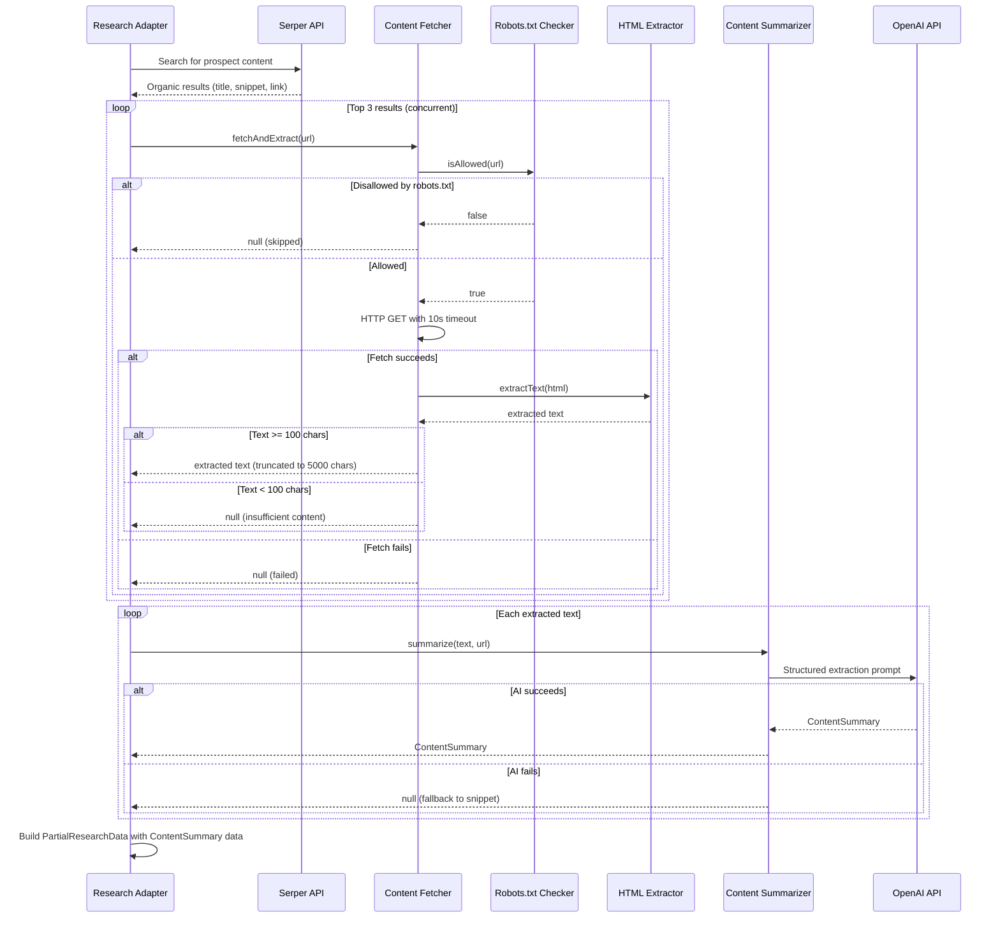
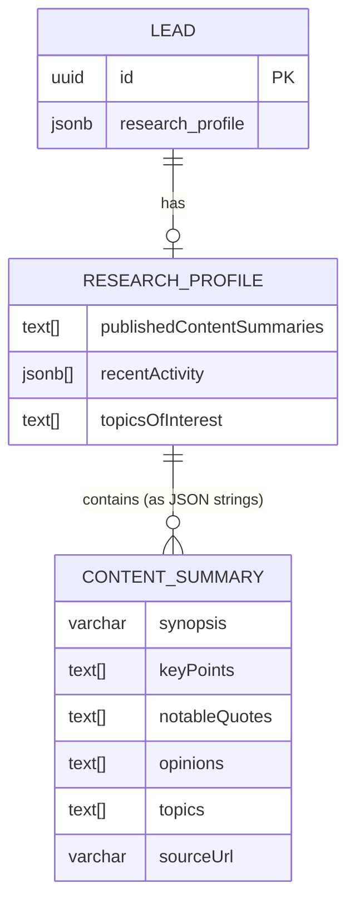

# Design Document: Deep Content Extraction

## Overview

This feature upgrades the blog, podcast, and conference research adapters from storing shallow Serper search result snippets to fetching actual page content, extracting readable text, and using AI to produce structured summaries. The result is a richer Research Profile that enables outreach messages to reference specific quotes, opinions, and topics from a prospect's published content.

Two new services are introduced:

1. **Content Fetcher Service** — Fetches HTML pages by URL, extracts readable text using `cheerio` (HTML parsing and boilerplate removal), enforces size limits and timeouts, and handles edge cases (non-HTML content, redirect chains, robots.txt).
2. **Content Summarizer Service** — Takes extracted article text and uses OpenAI to produce a structured `ContentSummary` containing key points, notable quotes, opinions expressed, topics discussed, and a short synopsis.

The existing blog, podcast, and conference research adapters are updated to call these services for their top Serper results. The `PersonalizationContextBuilder` is updated to parse `ContentSummary` JSON from `publishedContentSummaries`. The message generator prompt is enhanced to include specific content details.

### Key Design Decisions

1. **cheerio over Playwright for content extraction**: Playwright is available in the project but is heavyweight for simple text extraction. `cheerio` provides fast, synchronous HTML parsing without a browser process. It handles boilerplate removal by stripping `<nav>`, `<footer>`, `<aside>`, `<script>`, `<style>`, and ad-related elements, then extracting text from `<article>`, `<main>`, or `<body>` in priority order.

2. **ContentSummary stored as JSON strings in existing string[]**: Rather than changing the `publishedContentSummaries` type from `string[]` to a new type (which would break backward compatibility), each `ContentSummary` is JSON-serialized into the existing `string[]`. The `PersonalizationContextBuilder` attempts to parse each entry as JSON and falls back to treating it as a plain string for legacy data.

3. **Top 3 results per adapter**: Each adapter fetches content for at most 3 Serper results to balance depth against latency and API costs. Fetches run concurrently with individual 10-second timeouts.

4. **Graceful degradation at every stage**: If page fetch fails → skip that URL. If all fetches fail → use original Serper snippets. If AI summarization fails → use original snippet. The research pipeline never fails due to content extraction issues.

5. **Reuse existing OpenAI client pattern**: The Content Summarizer follows the same lazy singleton + `setOpenAIClient` test injection pattern used by `messageService.ts` and `personalizationContextBuilder.ts`.

6. **robots.txt checking via simple fetch**: A lightweight fetch of `/robots.txt` with caching per domain, parsed to check if the target path is disallowed. No heavy library dependency.

## Architecture

```mermaid
graph TD
    subgraph ResearchAdapters["Research Adapters (Updated)"]
        BlogAdapter["Blog Adapter"]
        PodcastAdapter["Podcast Adapter"]
        ConferenceAdapter["Conference Adapter"]
    end

    subgraph ContentPipeline["Content Extraction Pipeline (New)"]
        ContentFetcher["Content Fetcher Service"]
        RobotsChecker["Robots.txt Checker"]
        HTMLExtractor["HTML Text Extractor<br/>(cheerio)"]
        ContentSummarizer["Content Summarizer Service<br/>(OpenAI)"]
    end

    subgraph ExistingServices["Existing Services (Updated)"]
        PersonalizationCtx["Personalization Context Builder"]
        MessageService["Message Service"]
    end

    subgraph DataLayer["Data Layer"]
        SerperAPI["Serper API"]
        OpenAI["OpenAI API"]
        Postgres[(Postgres DB)]
    end

    BlogAdapter -->|Serper results| ContentFetcher
    PodcastAdapter -->|Serper results| ContentFetcher
    ConferenceAdapter -->|Serper results| ContentFetcher

    ContentFetcher --> RobotsChecker
    ContentFetcher --> HTMLExtractor
    HTMLExtractor -->|extracted text| ContentSummarizer
    ContentSummarizer --> OpenAI

    BlogAdapter -->|ContentSummary[]| Postgres
    PodcastAdapter -->|ContentSummary[]| Postgres
    ConferenceAdapter -->|ContentSummary[]| Postgres

    PersonalizationCtx -->|parse ContentSummary JSON| MessageService
    MessageService -->|enhanced prompt with quotes/opinions| OpenAI
```

### Content Extraction Flow



## Components and Interfaces

### 1. ContentSummary Type

New type defined in `src/types/index.ts`:

```typescript
interface ContentSummary {
  synopsis: string; // Plain-text summary, max 300 characters
  keyPoints: string[]; // 1–5 items
  notableQuotes: string[]; // 0–3 items
  opinions: string[]; // 0–3 items
  topics: string[]; // 1–5 items
  sourceUrl: string; // Original page URL
}
```

### 2. Content Fetcher Service

New service at `src/services/contentFetcherService.ts`.

```typescript
// Core function — fetches a URL and extracts readable text
function fetchAndExtract(url: string): Promise<string | null>;

// HTML text extraction using cheerio
function extractReadableText(html: string): string;

// Robots.txt checking with per-domain caching
function isAllowedByRobots(url: string): Promise<boolean>;

// Truncate extracted text to max length
function truncateText(text: string, maxLength: number): string;
```

The fetcher:

- Sets a `User-Agent: SignalFlow-Research-Bot/1.0` header
- Enforces a 10-second timeout per page via `AbortController`
- Checks `Content-Type` header — skips non-HTML responses (PDF, images, binary)
- Follows redirects up to 3 hops (using `fetch` with `redirect: 'follow'` and manual hop counting)
- Extracts text using `cheerio`: strips `<script>`, `<style>`, `<nav>`, `<footer>`, `<aside>`, `<header>`, ad-related elements, then reads from `<article>` or `<main>` or `<body>` in priority order
- Returns `null` if extracted text is less than 100 characters
- Truncates to 5000 characters

### 3. Content Summarizer Service

New service at `src/services/contentSummarizerService.ts`.

```typescript
// Core function — summarizes extracted text into a ContentSummary
function summarizeContent(text: string, sourceUrl: string): Promise<ContentSummary | null>;

// OpenAI client management (same pattern as messageService)
function setOpenAIClient(client: OpenAI | null): void;
```

The summarizer:

- Sends extracted text to OpenAI with a structured prompt requesting JSON output
- Uses `gpt-4o-mini` with `response_format: { type: 'json_object' }` for reliable structured output
- Enforces a 15-second timeout via `AbortController`
- Validates the response structure (correct field types, list length constraints)
- Returns `null` on any failure (API error, timeout, invalid response)

OpenAI prompt structure:

```
Extract a structured summary from the following article text.
Return a JSON object with these fields:
- synopsis: A single-paragraph plain-text summary, max 300 characters
- keyPoints: Array of 1-5 key points from the article
- notableQuotes: Array of 0-3 notable direct quotes
- opinions: Array of 0-3 opinions expressed by the author
- topics: Array of 1-5 topics discussed

Article text:
{text}
```

### 4. Updated Research Adapters

The `blogResearchAdapter`, `podcastResearchAdapter`, and `conferenceResearchAdapter` in `src/services/prospectResearcherService.ts` are updated to:

1. After receiving Serper results, call `fetchAndExtract` for the top 3 URLs concurrently
2. For each successfully extracted text, call `summarizeContent`
3. Build `PartialResearchData` using `ContentSummary` data:
   - `publishedContentSummaries`: JSON-serialized `ContentSummary` objects (or original `title: snippet` strings as fallback)
   - `recentActivity`: `ResearchActivity` entries with `summary` set to the `ContentSummary.synopsis` (or original snippet)
   - `topicsOfInterest`: Union of all `ContentSummary.topics`, deduplicated
4. If all fetches/summarizations fail, fall back to the existing behavior (Serper title + snippet)

### 5. Updated Personalization Context Builder

The `personalizationContextBuilder.ts` is updated with a new function:

```typescript
// Parse a publishedContentSummaries entry — returns ContentSummary if valid JSON, null otherwise
function parseContentSummary(entry: string): ContentSummary | null;

// Select the most relevant ContentSummary based on topic overlap with ICP pain points
function selectRelevantContent(
  summaries: ContentSummary[],
  icpPainPoints: string[],
): ContentSummary | null;
```

The `buildPersonalizationContext` function is updated to:

1. Parse `publishedContentSummaries` entries, separating structured `ContentSummary` objects from legacy plain strings
2. Select the most relevant `ContentSummary` based on topic overlap with ICP pain points
3. Expose the selected content details in the `PersonalizationContext`

### 6. Updated Message Generator

The `buildEnhancedPrompt` function in `messageService.ts` is updated to:

1. Check if the `PersonalizationContext` contains parsed `ContentSummary` data
2. If available, include specific quotes, opinions, or key points in the prompt
3. Instruct the AI to reference at least one specific detail from the prospect's actual content
4. Prefer content details whose topics overlap with the ICP pain points

### 7. PersonalizationContext Extension

The `PersonalizationContext` type is extended with an optional field:

```typescript
interface PersonalizationContext {
  // ... existing fields ...
  contentSummaries?: ContentSummary[]; // Parsed from publishedContentSummaries
  selectedContentDetail?: ContentSummary; // Most relevant for this outreach
}
```

## Data Models

### ContentSummary

New type — not persisted as a separate table. Stored as JSON strings within the existing `publishedContentSummaries: string[]` field on the Research Profile JSONB column.

```typescript
interface ContentSummary {
  synopsis: string; // Max 300 characters
  keyPoints: string[]; // 1–5 items
  notableQuotes: string[]; // 0–3 items
  opinions: string[]; // 0–3 items
  topics: string[]; // 1–5 items
  sourceUrl: string; // Original page URL
}
```

### Research Profile (Unchanged Schema)

No database migration needed. The `research_profile` JSONB column on the `lead` table already stores `publishedContentSummaries` as `string[]`. The change is in the content of those strings — from `"title: snippet"` to JSON-serialized `ContentSummary` objects.

```typescript
interface ResearchProfile {
  leadId: string;
  topicsOfInterest: string[]; // Now populated with ContentSummary topics
  currentChallenges: string[];
  recentActivity: ResearchActivity[]; // summary now uses ContentSummary.synopsis
  publishedContentSummaries: string[]; // Now contains JSON-serialized ContentSummary
  overallSentiment: 'positive' | 'neutral' | 'negative';
  sourcesUsed: string[];
  sourcesUnavailable: string[];
  researchedAt: Date;
}
```

### PersonalizationContext (Extended)

Transient — not persisted. Extended with optional content summary fields.

```typescript
interface PersonalizationContext {
  enrichedICP: EnrichedICP;
  researchProfile: ResearchProfile;
  intersectionAnalysis: IntersectionAnalysis;
  recentContentReference: ResearchActivity | null;
  painPointReference: PainPointMatch | null;
  contentSummaries?: ContentSummary[]; // Parsed structured summaries
  selectedContentDetail?: ContentSummary; // Most relevant for outreach
}
```

### Entity Relationships



## Correctness Properties

_A property is a characteristic or behavior that should hold true across all valid executions of a system — essentially, a formal statement about what the system should do. Properties serve as the bridge between human-readable specifications and machine-verifiable correctness guarantees._

### Property 1: ContentSummary serialization round-trip

_For any_ valid `ContentSummary` object (including those with empty lists for `notableQuotes`, `opinions`, or `topics`), serializing to a JSON string via `JSON.stringify` and then deserializing via `JSON.parse` SHALL produce an object deeply equal to the original, with empty lists preserved as empty lists (not converted to null).

**Validates: Requirements 5.1, 5.2, 5.3, 5.4**

### Property 2: ContentSummary field constraints

_For any_ valid `ContentSummary` produced by the Content Summarizer validation logic, the object SHALL have: a `synopsis` of at most 300 characters, between 1 and 5 `keyPoints`, between 0 and 3 `notableQuotes`, between 0 and 3 `opinions`, between 1 and 5 `topics`, and a non-empty `sourceUrl`. All fields SHALL be of their expected types (strings and string arrays).

**Validates: Requirements 2.1, 2.2, 2.3**

### Property 3: Text truncation enforces maximum length

_For any_ string input, the `truncateText` function with a max length of 5000 SHALL produce an output of at most 5000 characters. If the input is at most 5000 characters, the output SHALL equal the input unchanged.

**Validates: Requirements 1.3**

### Property 4: Minimum text length threshold

_For any_ extracted text string, the Content Fetcher SHALL return `null` if the text length is less than 100 characters, and SHALL return the (possibly truncated) text if the length is 100 characters or more.

**Validates: Requirements 6.2**

### Property 5: ResearchActivity summary maps to ContentSummary synopsis

_For any_ `ContentSummary` object used to build a `ResearchActivity` entry, the `ResearchActivity.summary` field SHALL equal the `ContentSummary.synopsis` value.

**Validates: Requirements 3.2**

### Property 6: Topics deduplication from ContentSummary objects

_For any_ list of `ContentSummary` objects, the resulting `topicsOfInterest` array SHALL contain exactly the set of unique topic strings from the union of all `ContentSummary.topics` arrays, with no duplicates.

**Validates: Requirements 3.3**

### Property 7: Enhanced prompt includes content details when ContentSummary is available

_For any_ `PersonalizationContext` containing at least one parsed `ContentSummary` with non-empty `keyPoints`, `notableQuotes`, or `opinions`, the enhanced prompt built by the Message Generator SHALL contain at least one string from the `ContentSummary`'s `keyPoints`, `notableQuotes`, or `opinions` arrays.

**Validates: Requirements 4.1**

### Property 8: Content selection prefers highest topic overlap with ICP pain points

_For any_ list of `ContentSummary` objects and a list of ICP pain point strings, the `selectRelevantContent` function SHALL return the `ContentSummary` whose `topics` array has the highest number of overlapping terms with the ICP pain points. If no overlap exists, it SHALL return the first `ContentSummary`.

**Validates: Requirements 4.3**

### Property 9: Legacy plain string parsing returns null

_For any_ string that is not valid JSON or is valid JSON but does not conform to the `ContentSummary` structure (missing required fields), the `parseContentSummary` function SHALL return `null`.

**Validates: Requirements 4.5**

### Property 10: Robots.txt disallow rules are respected

_For any_ robots.txt content containing `Disallow` directives for a user-agent matching `*` or `SignalFlow-Research-Bot`, and any URL path, the `isAllowedByRobots` function SHALL return `false` if the path matches a disallowed prefix, and `true` otherwise.

**Validates: Requirements 6.4**

## Error Handling

### Content Fetcher Errors

| Error Condition                            | Behavior                                                      | Impact                                               |
| ------------------------------------------ | ------------------------------------------------------------- | ---------------------------------------------------- |
| Network error / DNS failure                | Return `null` for that URL, log warning                       | Adapter continues with remaining URLs                |
| HTTP error status (4xx, 5xx)               | Return `null` for that URL, log warning                       | Adapter continues with remaining URLs                |
| 10-second timeout exceeded                 | Abort fetch via `AbortController`, return `null`              | Adapter continues with remaining URLs                |
| Non-HTML Content-Type (PDF, image, binary) | Return `null`, log as skipped                                 | Adapter continues with remaining URLs                |
| Extracted text < 100 characters            | Return `null` (insufficient content)                          | Adapter falls back to Serper snippet for that URL    |
| Redirect chain > 3 hops                    | Abort fetch, return `null`                                    | Adapter continues with remaining URLs                |
| Robots.txt disallows path                  | Return `null`, log as skipped                                 | Adapter continues with remaining URLs                |
| Robots.txt fetch fails                     | Assume allowed (permissive default)                           | Fetch proceeds normally                              |
| All 3 page fetches fail                    | Adapter falls back to original Serper title + snippet strings | Research Profile uses legacy format for that adapter |

### Content Summarizer Errors

| Error Condition                        | Behavior                                                                | Impact                                                |
| -------------------------------------- | ----------------------------------------------------------------------- | ----------------------------------------------------- |
| OpenAI API failure                     | Return `null`, log warning                                              | Adapter falls back to Serper snippet for that article |
| 15-second timeout exceeded             | Abort via `AbortController`, return `null`                              | Adapter falls back to Serper snippet                  |
| Invalid/unparseable AI response        | Return `null`, log warning with raw response                            | Adapter falls back to Serper snippet                  |
| AI response violates field constraints | Attempt to clamp (truncate synopsis, trim lists), return clamped result | Degraded but usable ContentSummary                    |
| Empty article text provided            | Return `null` immediately (no API call)                                 | Adapter falls back to Serper snippet                  |

### Personalization Context Builder Errors

| Error Condition                                                     | Behavior                                                               | Impact                                                                          |
| ------------------------------------------------------------------- | ---------------------------------------------------------------------- | ------------------------------------------------------------------------------- |
| JSON parse failure on publishedContentSummaries entry               | Treat as legacy plain string, return `null` from `parseContentSummary` | Backward compatible — plain strings used as-is                                  |
| No ContentSummary objects parsed (all legacy or all parse failures) | `contentSummaries` is empty array, `selectedContentDetail` is `null`   | Message generator falls back to existing behavior (no specific content details) |
| Topic overlap computation fails                                     | Select first ContentSummary as fallback                                | Degraded relevance but still provides content details                           |

### Message Generator Errors

| Error Condition                  | Behavior                                                          | Impact                                                               |
| -------------------------------- | ----------------------------------------------------------------- | -------------------------------------------------------------------- |
| No ContentSummary data available | Build prompt without specific content details (existing behavior) | Message uses existing personalization (pain points, recent activity) |
| OpenAI API failure               | Throw `LLM_UNAVAILABLE` error (existing behavior)                 | HTTP 503 returned to client                                          |

### General Principles

1. **Never fail the research pipeline**: Content extraction failures are isolated per-URL and per-adapter. The research pipeline always completes.
2. **Graceful degradation chain**: ContentSummary → Serper snippet → empty. Each stage has a fallback.
3. **Preserve existing data**: Content extraction failures never overwrite previously stored Research Profiles.
4. **Log all failures**: Every skipped URL, failed fetch, and failed summarization is logged with context (URL, adapter name, error details).

## Testing Strategy

### Property-Based Testing

This feature is well-suited for property-based testing. The core logic involves pure functions (text truncation, ContentSummary validation, serialization round-trips, topic deduplication, content selection, robots.txt parsing, prompt construction) with clear invariants.

**Library**: `fast-check` (already in devDependencies)
**Framework**: `vitest` (already in devDependencies)
**Minimum iterations**: 100 per property test

Each property test references its design document property:

- Tag format: **Feature: deep-content-extraction, Property {number}: {property_text}**

**Property test files:**

- `src/services/__tests__/contentSummary.property.test.ts` — Properties 1, 2, 5, 6
- `src/services/__tests__/contentFetcher.property.test.ts` — Properties 3, 4, 10
- `src/services/__tests__/contentPersonalization.property.test.ts` — Properties 7, 8, 9

### Unit Tests (Example-Based)

Unit tests cover specific examples, integration wiring, and error conditions:

- **Content Fetcher**: HTML boilerplate removal (Req 1.2), non-HTML content skipped (Req 6.1), redirect chain abort (Req 6.3), User-Agent header set (Req 6.5), timeout configuration (Req 1.5)
- **Content Summarizer**: AI failure fallback (Req 2.4), timeout configuration (Req 2.5), invalid AI response handling
- **Research Adapters**: Top 3 URLs fetched (Req 1.1), single fetch failure continues (Req 1.4), all fetches fail fallback (Req 1.6), no summaries fallback (Req 3.5)
- **Personalization Context Builder**: Legacy string backward compatibility (Req 4.5), prompt instruction text (Req 4.2)
- **Message Generator**: Prompt includes content details instruction (Req 4.2)

### Integration Tests

- End-to-end: Serper results → content fetch → summarization → Research Profile storage → message generation with content details
- Adapter with mixed fetch results (some succeed, some fail) → correct PartialResearchData
- PersonalizationContextBuilder with mixed legacy and ContentSummary entries

### Test Organization

```
src/
  services/
    __tests__/
      contentSummary.property.test.ts
      contentFetcher.property.test.ts
      contentPersonalization.property.test.ts
      contentFetcherService.test.ts
      contentSummarizerService.test.ts
      prospectResearcherService.test.ts  (extended)
      personalizationContextBuilder.test.ts  (extended)
```
