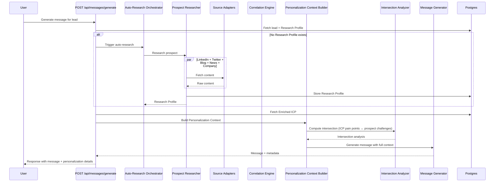
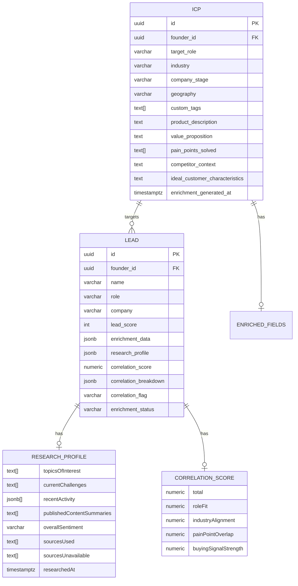

# Design Document: Intelligent Outreach Personalization

## Overview

This feature transforms the outreach pipeline from a generic keyword-matching system into a deeply contextual, research-driven personalization engine. It introduces five interconnected enhancements:

1. **Enriched ICP Generation** — Extends the existing ICP with product description, value proposition, pain points, competitor context, and ideal customer characteristics so downstream services understand _why_ to target someone, not just _who_.
2. **Deep Prospect Research** — A new `ProspectResearcherService` that aggregates content from LinkedIn, Twitter, blogs, news, podcasts, and conference talks into a structured `ResearchProfile` for each lead.
3. **Prospect-ICP Correlation** — A new `CorrelationEngine` that scores prospects against the Enriched ICP on semantic dimensions (role fit, industry alignment, pain point overlap, buying signals) producing a 0.0–1.0 `CorrelationScore`.
4. **Hyper-Personalized Cold Outreach** — Enhanced `MessageService` that builds a `PersonalizationContext` from the Enriched ICP, Research Profile, and intersection analysis, then generates messages referencing specific prospect content and pain points.
5. **Manual Lead Auto-Research** — A seamless workflow where manually added leads are automatically researched before message generation, with progress indicators and stale-research refresh.

### Key Design Decisions

1. **Extend, don't replace**: The existing `ICP`, `EnrichmentData`, and `Lead` types are extended with new optional fields. All existing services (scoring, quality gate, pipeline orchestrator) continue working without modification.

2. **Research Profile as a separate JSONB column**: Rather than overloading the existing `enrichment_data` JSONB column, the Research Profile is stored in a new `research_profile` JSONB column on the `lead` table. This keeps enrichment data (LinkedIn bio, email, company info) separate from deep research data (topics, challenges, content summaries).

3. **Correlation Score stored alongside lead**: The `correlation_score` and `correlation_breakdown` are stored as new columns on the `lead` table, enabling efficient sorting and filtering without JSONB queries.

4. **OpenAI for semantic analysis**: Pain point overlap and buying signal detection use OpenAI embeddings (via the existing OpenAI client) for semantic similarity rather than keyword matching. This enables meaningful correlation even when terminology differs.

5. **Progressive research with timeout**: The Prospect Researcher executes sources concurrently with a 120-second overall timeout. Partial results are returned if some sources are slow or unavailable.

6. **Intersection analysis as a pure function**: The pain-point-to-challenge mapping is computed as a pure function from the Enriched ICP and Research Profile, making it deterministic and testable.

7. **Reuse existing enrichment infrastructure**: The Prospect Researcher leverages the existing source adapters (LinkedIn scraper, Twitter scraper, news scraper, company website scraper) from the enrichment pipeline, adding new adapters for blog/podcast/conference content.

## Architecture

```mermaid
graph TD
    subgraph ICPLayer["Enriched ICP Layer"]
        ICPGenRoute["POST /api/icp/generate"]
        ICPService["icpService.ts"]
        EnrichedICPGen["Enriched ICP Generator<br/>(OpenAI)"]
    end

    subgraph ResearchLayer["Prospect Research Layer"]
        ProspectResearcher["ProspectResearcherService"]
        LinkedInAdapter["LinkedIn Adapter"]
        TwitterAdapter["Twitter Adapter"]
        BlogAdapter["Blog/Podcast Adapter"]
        NewsAdapter["News Adapter"]
        CompanyAdapter["Company Website Adapter"]
    end

    subgraph CorrelationLayer["Correlation Layer"]
        CorrelationEngine["CorrelationEngine"]
        RoleFitScorer["Role Fit Scorer"]
        IndustryScorer["Industry Alignment Scorer"]
        PainPointScorer["Pain Point Overlap Scorer<br/>(OpenAI embeddings)"]
        BuyingSignalScorer["Buying Signal Scorer"]
    end

    subgraph MessageLayer["Message Generation Layer"]
        MessageRoute["POST /api/messages/generate"]
        MessageService["messageService.ts"]
        PersonalizationCtx["Personalization Context Builder"]
        IntersectionAnalyzer["Intersection Analyzer"]
    end

    subgraph AutoResearch["Manual Lead Auto-Research"]
        LeadCreateRoute["POST /api/leads"]
        AutoResearchOrch["Auto-Research Orchestrator"]
        ProgressTracker["Progress Tracker"]
    end

    subgraph Data["Data Layer"]
        Postgres[(Postgres DB)]
        OpenAI["OpenAI API"]
    end

    subgraph Existing["Existing Services"]
        DiscoveryEngine["Discovery Engine"]
        EnrichmentPipeline["Enrichment Pipeline"]
        ScoringService["Scoring Service"]
        PipelineOrch["Pipeline Orchestrator"]
    end

    ICPGenRoute --> EnrichedICPGen
    EnrichedICPGen --> OpenAI
    EnrichedICPGen --> ICPService
    ICPService --> Postgres

    DiscoveryEngine -->|new leads| ProspectResearcher
    LeadCreateRoute -->|manual leads| ProspectResearcher
    ProspectResearcher --> LinkedInAdapter
    ProspectResearcher --> TwitterAdapter
    ProspectResearcher --> BlogAdapter
    ProspectResearcher --> NewsAdapter
    ProspectResearcher --> CompanyAdapter
    ProspectResearcher --> Postgres

    DiscoveryEngine -->|prospects| CorrelationEngine
    CorrelationEngine --> RoleFitScorer
    CorrelationEngine --> IndustryScorer
    CorrelationEngine --> PainPointScorer
    CorrelationEngine --> BuyingSignalScorer
    PainPointScorer --> OpenAI
    CorrelationEngine --> Postgres

    MessageRoute --> PersonalizationCtx
    PersonalizationCtx --> IntersectionAnalyzer
    IntersectionAnalyzer --> OpenAI
    PersonalizationCtx --> MessageService
    MessageService --> OpenAI

    AutoResearchOrch --> ProspectResearcher
    AutoResearchOrch --> PersonalizationCtx
    AutoResearchOrch --> ProgressTracker

    ICPService -->|Enriched ICP| CorrelationEngine
    ICPService -->|Enriched ICP| PersonalizationCtx
    ProspectResearcher -->|Research Profile| CorrelationEngine
    ProspectResearcher -->|Research Profile| PersonalizationCtx
```



### Research + Message Generation Flow



## Components and Interfaces

### 1. Enriched ICP Generator

Extends the existing `POST /api/icp/generate` route and `icpService.ts` to produce an Enriched ICP with additional fields.

```typescript
interface EnrichedICP extends ICP {
  productDescription?: string;
  valueProposition?: string;
  painPointsSolved?: string[]; // 1–10 items, each ≤200 chars
  competitorContext?: string;
  idealCustomerCharacteristics?: string;
  enrichmentGeneratedAt?: Date;
}

// Updated icpService functions
function generateEnrichedICP(productDescription: string, existingICP?: ICP): Promise<EnrichedICP>;
function saveEnrichedICP(input: EnrichedICPInput): Promise<EnrichedICP>;
function getEnrichedICP(founderId: string): Promise<EnrichedICP | null>;
```

The generator sends the product description to OpenAI with a structured prompt requesting all enrichment fields. On update, it preserves manually edited base ICP fields (targetRole, industry, etc.) and only regenerates the enrichment fields. On AI failure, the existing Enriched ICP is preserved unchanged and a descriptive error is returned.

### 2. Prospect Researcher Service

New service at `src/services/prospectResearcherService.ts` that orchestrates deep research on a prospect.

```typescript
interface ResearchProfile {
  leadId: string;
  topicsOfInterest: string[];
  currentChallenges: string[];
  recentActivity: ResearchActivity[];
  publishedContentSummaries: string[];
  overallSentiment: 'positive' | 'neutral' | 'negative';
  sourcesUsed: string[];
  sourcesUnavailable: string[];
  researchedAt: Date;
}

interface ResearchActivity {
  summary: string;
  source: string; // e.g., "linkedin", "twitter", "blog", "news", "podcast", "conference"
  timestamp: Date;
  url?: string;
}

// Functions
function researchProspect(lead: Lead): Promise<ResearchProfile>;
function getResearchProfile(leadId: string): Promise<ResearchProfile | null>;
function isResearchStale(profile: ResearchProfile, thresholdDays: number): boolean;
```

The researcher executes all source adapters concurrently with a 120-second overall timeout via `Promise.allSettled`. Each adapter returns partial research data that is merged into the final `ResearchProfile`. Unavailable sources are recorded in `sourcesUnavailable`. The lead's enrichment status is set to `"researching"` during execution and updated to `"complete"` or `"partial"` upon completion.

### 3. Correlation Engine

New service at `src/services/correlationEngineService.ts` that computes semantic correlation scores.

```typescript
interface CorrelationScore {
  total: number; // 0.0–1.0
  breakdown: CorrelationBreakdown;
}

interface CorrelationBreakdown {
  roleFit: number; // 0.0–1.0, weight: 0.25
  industryAlignment: number; // 0.0–1.0, weight: 0.25
  painPointOverlap: number; // 0.0–1.0, weight: 0.35
  buyingSignalStrength: number; // 0.0–1.0, weight: 0.15
}

const CORRELATION_WEIGHTS = {
  roleFit: 0.25,
  industryAlignment: 0.25,
  painPointOverlap: 0.35,
  buyingSignalStrength: 0.15,
} as const;

// Functions
function computeCorrelationScore(
  prospect: Lead,
  researchProfile: ResearchProfile,
  enrichedICP: EnrichedICP,
): Promise<CorrelationScore>;

function computeRoleFit(prospectRole: string, icpTargetRole: string): number;
function computeIndustryAlignment(
  prospectIndustry: string | undefined,
  icpIndustry: string,
): number;
function computePainPointOverlap(
  prospectChallenges: string[],
  icpPainPoints: string[],
): Promise<number>;
function computeBuyingSignalStrength(recentActivity: ResearchActivity[]): number;

function recalculateCorrelationScores(founderId: string): Promise<void>;
```

Dimension scoring:

- **Role Fit**: Normalized string comparison with semantic similarity fallback (reuses `computeRoleRelevance` logic from `scoringService.ts`, scaled to 0.0–1.0).
- **Industry Alignment**: Exact match = 1.0, partial/related = 0.5, no match = 0.0.
- **Pain Point Overlap**: Uses OpenAI embeddings to compute cosine similarity between prospect challenges and ICP pain points. The highest pairwise similarity is averaged across all ICP pain points.
- **Buying Signal Strength**: Scores based on recency and volume of activity indicating purchase intent (e.g., posts about evaluating tools, hiring for relevant roles, discussing pain points).

### 4. Personalization Context Builder

New module at `src/services/personalizationContextBuilder.ts` that assembles the full context for message generation.

```typescript
interface PersonalizationContext {
  enrichedICP: EnrichedICP;
  researchProfile: ResearchProfile;
  intersectionAnalysis: IntersectionAnalysis;
  recentContentReference: ResearchActivity | null; // Most recent activity <30 days
  painPointReference: PainPointMatch | null; // Best pain point match
}

interface IntersectionAnalysis {
  painPointMatches: PainPointMatch[];
  overallRelevanceScore: number; // 0.0–1.0
}

interface PainPointMatch {
  founderPainPoint: string;
  prospectChallenge: string;
  similarityScore: number; // 0.0–1.0
}

// Functions
function buildPersonalizationContext(
  enrichedICP: EnrichedICP,
  researchProfile: ResearchProfile,
): Promise<PersonalizationContext>;

function computeIntersectionAnalysis(
  icpPainPoints: string[],
  prospectChallenges: string[],
): Promise<IntersectionAnalysis>;

function selectRecentContent(
  activities: ResearchActivity[],
  maxAgeDays: number,
): ResearchActivity | null;

function selectBestPainPointMatch(matches: PainPointMatch[]): PainPointMatch | null;
```

### 5. Enhanced Message Generator

Extends the existing `messageService.ts` to accept and use the `PersonalizationContext`.

```typescript
// Extended input type
interface EnhancedGenerateMessageInput extends GenerateMessageInput {
  personalizationContext?: PersonalizationContext;
}

// Extended response type
interface EnhancedMessageResponse extends MessageResponse {
  personalizationMetadata?: PersonalizationMetadata;
}

interface PersonalizationMetadata {
  sourcesUsed: string[];
  painPointsReferenced: string[];
  contentReferenced: string[];
  intersectionScore: number;
}

// Updated functions
function buildEnhancedPrompt(input: EnhancedGenerateMessageInput): string;
function generateEnhancedMessage(
  input: EnhancedGenerateMessageInput,
): Promise<EnhancedMessageResponse>;
```

The enhanced prompt instructs OpenAI to:

- Reference at least one specific piece of recent content from the Research Profile
- Address at least one pain point from the intersection analysis
- Avoid generic phrases ("I hope this finds you well", "I came across your profile", "I wanted to reach out")
- Prioritize content newer than 30 days
- Stay within word limits (150 for DMs, 250 for emails)

### 6. Auto-Research Orchestrator

New module at `src/services/autoResearchOrchestrator.ts` that coordinates the research-then-generate workflow for manual leads.

```typescript
interface AutoResearchProgress {
  stage:
    | 'researching_linkedin'
    | 'researching_twitter'
    | 'researching_blogs'
    | 'analyzing_content'
    | 'generating_message'
    | 'complete'
    | 'failed';
  percentComplete: number;
  message: string;
}

interface AutoResearchResult {
  researchProfile: ResearchProfile;
  message: EnhancedMessageResponse;
  researchWasRefreshed: boolean;
}

// Functions
function researchAndGenerate(
  lead: Lead,
  messageRequest: MessageRequest,
  enrichedICP: EnrichedICP,
  onProgress?: (progress: AutoResearchProgress) => void,
): Promise<AutoResearchResult>;

function shouldRefreshResearch(profile: ResearchProfile): boolean;
```

The orchestrator:

1. Checks if the lead has an existing Research Profile
2. If missing or stale (>7 days), triggers the Prospect Researcher
3. Reports progress through the callback
4. On research completion, builds the Personalization Context and generates the message
5. Total timeout: 180 seconds
6. On complete research failure, falls back to Enriched ICP + basic lead info

### 7. Updated API Routes

**`POST /api/icp/generate`** — Extended to accept `productDescription` and return Enriched ICP fields.

**`POST /api/messages/generate`** — Extended to auto-trigger research for leads without a Research Profile, return personalization metadata.

**`POST /api/leads`** — Extended to trigger async deep research after lead creation.

**`GET /api/leads/[id]/research`** — New route to fetch a lead's Research Profile.

**`POST /api/leads/[id]/research/refresh`** — New route to manually trigger research refresh.

**`GET /api/leads/[id]/correlation`** — New route to fetch a lead's Correlation Score breakdown.

**`POST /api/leads/recalculate`** — Extended to also recalculate Correlation Scores when ICP changes.

## Data Models

### Enriched ICP (Extended)

The existing `ICP` interface is extended with new optional fields. The `icp` table gets new columns.

```typescript
interface EnrichedICP extends ICP {
  // Existing fields (unchanged)
  id: string;
  founderId: string;
  targetRole: string;
  industry: string;
  companyStage?: string;
  geography?: string;
  customTags?: string[];
  createdAt: Date;
  updatedAt: Date;

  // New enrichment fields
  productDescription?: string;
  valueProposition?: string;
  painPointsSolved?: string[];
  competitorContext?: string;
  idealCustomerCharacteristics?: string;
  enrichmentGeneratedAt?: Date;
}
```

**Database migration** — New columns on the `icp` table:

```sql
ALTER TABLE icp ADD COLUMN product_description TEXT;
ALTER TABLE icp ADD COLUMN value_proposition TEXT;
ALTER TABLE icp ADD COLUMN pain_points_solved TEXT[];
ALTER TABLE icp ADD COLUMN competitor_context TEXT;
ALTER TABLE icp ADD COLUMN ideal_customer_characteristics TEXT;
ALTER TABLE icp ADD COLUMN enrichment_generated_at TIMESTAMPTZ;
```

### Research Profile

Stored as a JSONB column on the `lead` table.

```typescript
interface ResearchProfile {
  leadId: string;
  topicsOfInterest: string[];
  currentChallenges: string[];
  recentActivity: ResearchActivity[];
  publishedContentSummaries: string[];
  overallSentiment: 'positive' | 'neutral' | 'negative';
  sourcesUsed: string[];
  sourcesUnavailable: string[];
  researchedAt: Date;
}

interface ResearchActivity {
  summary: string;
  source: string;
  timestamp: Date;
  url?: string;
}
```

**Database migration** — New column on the `lead` table:

```sql
ALTER TABLE lead ADD COLUMN research_profile JSONB;
```

### Correlation Score

Stored as dedicated columns on the `lead` table for efficient querying.

```typescript
interface CorrelationBreakdown {
  roleFit: number;
  industryAlignment: number;
  painPointOverlap: number;
  buyingSignalStrength: number;
}
```

**Database migration** — New columns on the `lead` table:

```sql
ALTER TABLE lead ADD COLUMN correlation_score NUMERIC(4,3);
ALTER TABLE lead ADD COLUMN correlation_breakdown JSONB;
ALTER TABLE lead ADD COLUMN correlation_flag VARCHAR(20);  -- 'low_correlation' or NULL
```

### Personalization Context (Transient)

Not persisted — computed on-the-fly during message generation.

```typescript
interface PersonalizationContext {
  enrichedICP: EnrichedICP;
  researchProfile: ResearchProfile;
  intersectionAnalysis: IntersectionAnalysis;
  recentContentReference: ResearchActivity | null;
  painPointReference: PainPointMatch | null;
}

interface IntersectionAnalysis {
  painPointMatches: PainPointMatch[];
  overallRelevanceScore: number;
}

interface PainPointMatch {
  founderPainPoint: string;
  prospectChallenge: string;
  similarityScore: number;
}
```

### Entity Relationships



## Correctness Properties

_A property is a characteristic or behavior that should hold true across all valid executions of a system — essentially, a formal statement about what the system should do. Properties serve as the bridge between human-readable specifications and machine-verifiable correctness guarantees._

### Property 1: Enriched ICP field completeness

_For any_ non-empty product description string, the Enriched ICP Generator (with a mocked OpenAI returning valid structured JSON) SHALL produce an output containing all required enrichment fields: `productDescription`, `valueProposition`, `painPointsSolved` (non-empty list), `competitorContext`, and `idealCustomerCharacteristics`, each being non-empty.

**Validates: Requirements 1.1**

### Property 2: Enriched ICP field preservation on regeneration

_For any_ existing Enriched ICP with populated base fields (targetRole, industry, companyStage, geography, customTags) and a new product description, regenerating the enrichment fields SHALL produce an Enriched ICP where all base fields that were not explicitly changed by the founder remain identical to their original values, while the enrichment fields are updated.

**Validates: Requirements 1.2, 1.3**

### Property 3: Pain points list constraints

_For any_ generated Enriched ICP, the `painPointsSolved` list SHALL contain between 1 and 10 items inclusive, and each item SHALL be a non-empty string of at most 200 characters.

**Validates: Requirements 1.6**

### Property 4: Research Profile output completeness with graceful degradation

_For any_ set of source adapter results (including any combination of successes and failures), the Prospect Researcher SHALL produce a Research Profile containing all required fields (`topicsOfInterest`, `currentChallenges`, `recentActivity`, `publishedContentSummaries`, `overallSentiment`), and every source that failed or returned no data SHALL appear in the `sourcesUnavailable` list.

**Validates: Requirements 2.4, 2.6**

### Property 5: Research Profile serialization round-trip

_For any_ valid Research Profile object (including those with empty lists for `topicsOfInterest`, `currentChallenges`, or `recentActivity`), serializing to JSON and then deserializing back SHALL produce an object deeply equal to the original, with empty lists preserved as empty lists (not converted to null).

**Validates: Requirements 6.1, 6.2, 6.3, 6.4**

### Property 6: Correlation score is weighted sum of dimensions

_For any_ set of dimension scores (roleFit, industryAlignment, painPointOverlap, buyingSignalStrength each in [0.0, 1.0]), the Correlation Engine's total score SHALL equal `0.25 * roleFit + 0.25 * industryAlignment + 0.35 * painPointOverlap + 0.15 * buyingSignalStrength`, within floating-point tolerance (±0.001).

**Validates: Requirements 3.2, 3.3**

### Property 7: Correlation score bounded

_For any_ prospect, Research Profile, and Enriched ICP inputs (including extreme values, empty fields, and missing data), the Correlation Engine SHALL produce a total Correlation Score in the range [0.0, 1.0] inclusive, and each dimension score in the breakdown SHALL also be in [0.0, 1.0] inclusive.

**Validates: Requirements 3.4, 7.1**

### Property 8: Correlation score determinism

_For any_ identical inputs (same prospect, same Research Profile, same Enriched ICP), the Correlation Engine SHALL produce identical Correlation Scores across multiple invocations.

**Validates: Requirements 7.2**

### Property 9: Low correlation flag threshold

_For any_ Correlation Score, the prospect SHALL be flagged as `"low_correlation"` if and only if the total score is below 0.3. Prospects with scores ≥ 0.3 SHALL NOT have the flag set.

**Validates: Requirements 3.5**

### Property 10: Recent content selection prioritizes recent activity

_For any_ list of Research Activities with varying timestamps, the `selectRecentContent` function SHALL return the most recent activity that is within the specified `maxAgeDays` threshold, or null if no activity falls within the threshold.

**Validates: Requirements 4.5**

### Property 11: Empty research profile triggers limited personalization

_For any_ Research Profile where all content lists (`topicsOfInterest`, `currentChallenges`, `recentActivity`, `publishedContentSummaries`) are empty, the Message Generator SHALL set `limitedPersonalization` to `true` in the response.

**Validates: Requirements 4.6**

### Property 12: Banned phrase exclusion

_For any_ generated outreach message that passes validation, the message text SHALL NOT contain any of the banned phrases: "I hope this finds you well", "I came across your profile", or "I wanted to reach out" (case-insensitive).

**Validates: Requirements 4.4**

### Property 13: Research staleness detection

_For any_ Research Profile with a `researchedAt` timestamp and a staleness threshold in days, the `isResearchStale` function SHALL return `true` if and only if the difference between the current time and `researchedAt` exceeds the threshold.

**Validates: Requirements 5.7**

## Error Handling

### ICP Generation Errors

| Error Condition                      | Behavior                                                                    | HTTP Status |
| ------------------------------------ | --------------------------------------------------------------------------- | ----------- |
| OpenAI API failure during enrichment | Return descriptive error, preserve existing Enriched ICP unchanged          | 502         |
| Invalid/unparseable AI response      | Return error with raw response snippet for debugging, preserve existing ICP | 502         |
| Missing product description          | Return validation error                                                     | 400         |
| Database write failure               | Return error, ICP not updated                                               | 500         |

### Prospect Research Errors

| Error Condition                             | Behavior                                                                                                             | HTTP Status         |
| ------------------------------------------- | -------------------------------------------------------------------------------------------------------------------- | ------------------- |
| Individual source adapter failure           | Continue with remaining sources, record in `sourcesUnavailable`                                                      | N/A (internal)      |
| All source adapters fail                    | Return Research Profile with empty content lists, all sources in `sourcesUnavailable`, enrichment status = "partial" | N/A (internal)      |
| 120-second timeout exceeded                 | Return partial results from completed sources                                                                        | N/A (internal)      |
| Database write failure for Research Profile | Log error, return research results without persistence (next generation will re-research)                            | 500 (if API-facing) |

### Correlation Engine Errors

| Error Condition                               | Behavior                                                                                     | HTTP Status    |
| --------------------------------------------- | -------------------------------------------------------------------------------------------- | -------------- |
| OpenAI embedding failure (pain point overlap) | Fall back to keyword-based similarity (cosine similarity on TF-IDF vectors), log degradation | N/A (internal) |
| Missing Research Profile                      | Compute correlation with pain point overlap and buying signal scores set to 0.0              | N/A (internal) |
| Missing Enriched ICP                          | Skip correlation computation, log warning                                                    | N/A (internal) |
| Invalid dimension score (NaN/Infinity)        | Clamp to 0.0, log warning                                                                    | N/A (internal) |

### Message Generation Errors

| Error Condition                  | Behavior                                                                              | HTTP Status |
| -------------------------------- | ------------------------------------------------------------------------------------- | ----------- |
| OpenAI API failure               | Return `LLM_UNAVAILABLE` error (existing behavior)                                    | 503         |
| No Research Profile available    | Fall back to Enriched ICP + basic lead info, set `limitedPersonalization: true`       | 200         |
| No Enriched ICP available        | Fall back to existing message generation (basic enrichment data only)                 | 200         |
| Auto-research timeout (180s)     | Generate message with whatever research completed, set `limitedPersonalization: true` | 200         |
| Banned phrase detected in output | Re-generate with stronger prompt instructions (max 1 retry), then return with warning | 200         |

### General Error Handling Principles

1. **Graceful degradation**: Every component has a fallback path. Research failures don't block message generation. Correlation failures don't block outreach.
2. **Preserve existing data**: AI failures never overwrite previously saved data (Enriched ICP, Research Profiles).
3. **Transparent failures**: All error responses include machine-readable error codes and human-readable descriptions following the existing `ApiError` interface.
4. **Logging**: All errors are logged with context (lead ID, founder ID, source name, error details) for debugging.

## Testing Strategy

### Property-Based Testing

This feature is well-suited for property-based testing. The core logic involves pure functions (correlation scoring, serialization, content selection, staleness detection) and data transformations with clear invariants.

**Library**: `fast-check` (already in devDependencies)
**Framework**: `vitest` (already in devDependencies)
**Minimum iterations**: 100 per property test

Each property test references its design document property:

- Tag format: **Feature: intelligent-outreach-personalization, Property {number}: {property_text}**

**Property test files:**

- `src/services/__tests__/correlationEngine.property.test.ts` — Properties 6, 7, 8, 9
- `src/services/__tests__/researchProfile.property.test.ts` — Properties 4, 5, 13
- `src/services/__tests__/enrichedICP.property.test.ts` — Properties 1, 2, 3
- `src/services/__tests__/messagePersonalization.property.test.ts` — Properties 10, 11, 12

### Unit Tests (Example-Based)

Unit tests cover specific examples, integration wiring, and error conditions:

- **ICP Generation**: AI failure preserves existing ICP (Req 1.5), prompt includes product description
- **Prospect Researcher**: Discovery triggers research (Req 2.1), manual lead triggers research (Req 2.2), all source categories queried (Req 2.3), enrichment status transitions (Req 2.7)
- **Message Generator**: Prompt includes recent content instructions (Req 4.2), prompt includes pain point intersection (Req 4.3), metadata returned (Req 4.8)
- **Auto-Research**: Progress callback stages (Req 5.3), complete failure fallback (Req 5.5), research not repeated when profile exists (Req 5.6)
- **Correlation Engine**: ICP update triggers recalculation (Req 3.7), weights sum to 1.0 (Req 7.5)

### Integration Tests

- End-to-end ICP generation → storage → retrieval
- Lead creation → auto-research trigger → Research Profile storage
- Discovery → correlation scoring → low_correlation flagging
- Message generation with full personalization context
- Auto-research → message generation workflow within timeout

### Test Organization

```
src/
  services/
    __tests__/
      correlationEngine.property.test.ts
      researchProfile.property.test.ts
      enrichedICP.property.test.ts
      messagePersonalization.property.test.ts
      correlationEngineService.test.ts
      prospectResearcherService.test.ts
      personalizationContextBuilder.test.ts
      autoResearchOrchestrator.test.ts
```
