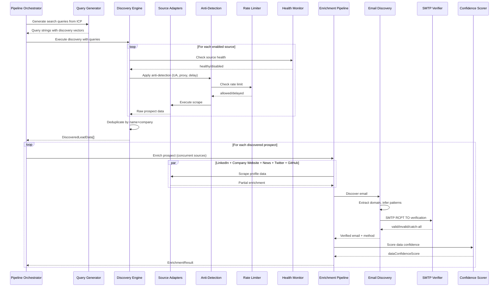
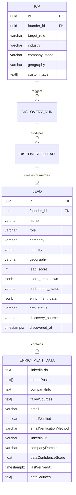

# Design Document: Proprietary Lead Discovery & Enrichment Engine

## Overview

This feature replaces the mock implementations of `discoverLeads()` and `enrichLead()` in `src/services/enrichmentService.ts` with a fully proprietary discovery and enrichment engine. The engine uses web scraping (Google Search, LinkedIn, GitHub, Twitter/X, Crunchbase/AngelList/YC, Google Maps, company websites, Google News), AI-powered query generation (via the existing OpenAI integration), and direct SMTP email verification to discover real prospects, enrich their profiles, and find verified email addresses — all at zero external API cost.

Paid APIs (Apollo.io, Hunter.io, Clearbit) are supported as optional premium accelerators behind feature flags. The system works identically with all premium adapters disabled.

### Key Design Decisions

1. **Pluggable Source_Adapter pattern**: Every scraping target and premium API implements a common `SourceAdapter` interface. The Discovery Engine and Enrichment Pipeline iterate over enabled adapters, making it trivial to add, remove, or disable sources without touching orchestration logic.

2. **Playwright for browser-based scraping**: LinkedIn, Google Search, Google Maps, and directory sites require JavaScript rendering. Playwright provides headless Chromium with full JS execution, cookie handling, and screenshot capabilities for debugging blocked requests.

3. **Sliding-window rate limiter with daily budgets**: A per-source sliding window counter (in-memory Map keyed by source name) enforces per-minute rate limits. A separate daily counter prevents runaway scraping. Both are configurable via environment variables.

4. **Circuit breaker pattern for source health**: Each source adapter is wrapped by a health monitor that tracks consecutive failures. After 5 failures, the source is disabled for a configurable cooldown period, then re-enabled with a single probe request before resuming full traffic.

5. **SMTP RCPT TO verification**: Email verification connects directly to the company's MX server and performs an SMTP handshake (HELO → MAIL FROM → RCPT TO → QUIT) to check mailbox existence without sending an email. Catch-all detection uses a known-invalid address probe.

6. **Confidence scoring via multi-source corroboration**: The Confidence Scorer assigns scores based on how many independent sources agree on a data field. Premium API data is weighted higher than single-source scrapes.

7. **Extend existing types, preserve backward compatibility**: The `EnrichmentData` type is extended with new optional fields (email, emailVerified, linkedinUrl, companyDomain, dataConfidenceScore, lastVerifiedAt, dataSources, emailVerificationMethod). Existing fields (`linkedinBio`, `recentPosts`, `companyInfo`, `failedSources`) remain unchanged so the scoring service, message service, and quality gate continue working without modification.

8. **Company-level caching per pipeline run**: Company website content, MX records, and email patterns are cached by normalized domain for the duration of a pipeline run to avoid redundant scraping when multiple prospects share a company.

9. **Concurrent enrichment with timeout**: Source adapters execute concurrently via `Promise.allSettled` with a 90-second per-prospect timeout. Partial results are returned if the timeout fires.

## Architecture

```mermaid
graph TD
    subgraph Pipeline["Pipeline Orchestrator (existing)"]
        DiscoveryStage["Discovery Stage"]
        EnrichmentStep["Enrichment Step"]
    end

    subgraph DiscoveryEngine["Discovery Engine"]
        QueryGen["Query Generator<br/>(OpenAI)"]
        SourceOrch["Source Orchestrator"]
        Dedup["Deduplicator"]
    end

    subgraph SourceAdapters["Source Adapters"]
        GoogleScraper["Google Search Scraper"]
        LinkedInScraper["LinkedIn Scraper"]
        GitHubScraper["GitHub Scraper"]
        TwitterScraper["Twitter Scraper"]
        DirectoryScraper["Directory Scraper"]
        MapsScraper["Maps Scraper"]
        CompanyWebScraper["Company Website Scraper"]
        NewsScraper["News Scraper"]
        ApolloAdapter["Apollo Adapter<br/>(optional)"]
        HunterAdapter["Hunter Adapter<br/>(optional)"]
        ClearbitAdapter["Clearbit Adapter<br/>(optional)"]
    end

    subgraph EmailDiscovery["Email Discovery Engine"]
        DomainExtractor["Domain Extractor"]
        PatternInference["Pattern Inference"]
        SMTPVerifier["SMTP Verifier"]
        MXLookup["MX Record Lookup"]
    end

    subgraph Infrastructure["Infrastructure Layer"]
        RateLimiter["Rate Limiter<br/>(sliding window + daily budget)"]
        HealthMonitor["Source Health Monitor<br/>(circuit breaker)"]
        AntiDetection["Anti-Detection Manager<br/>(UA rotation, proxy, delays)"]
        ConfidenceScorer["Confidence Scorer"]
        RunCache["Pipeline Run Cache<br/>(company-level)"]
    end

    subgraph Existing["Existing Services"]
        ScoringService["Scoring Service"]
        MessageService["Message Service"]
        QualityGate["Quality Gate Service"]
        LeadService["Lead Service"]
    end

    subgraph Data["Data Layer"]
        Postgres[(Postgres DB)]
        OpenAI["OpenAI API"]
    end

    DiscoveryStage --> QueryGen
    QueryGen --> OpenAI
    DiscoveryStage --> SourceOrch
    SourceOrch --> GoogleScraper
    SourceOrch --> GitHubScraper
    SourceOrch --> TwitterScraper
    SourceOrch --> MapsScraper
    SourceOrch --> ApolloAdapter
    SourceOrch --> Dedup

    GoogleScraper --> DirectoryScraper
    GoogleScraper --> LinkedInScraper
    MapsScraper --> CompanyWebScraper

    EnrichmentStep --> LinkedInScraper
    EnrichmentStep --> CompanyWebScraper
    EnrichmentStep --> NewsScraper
    EnrichmentStep --> TwitterScraper
    EnrichmentStep --> GitHubScraper
    EnrichmentStep --> ClearbitAdapter
    EnrichmentStep --> EmailDiscovery
    EnrichmentStep --> ConfidenceScorer

    EmailDiscovery --> DomainExtractor
    EmailDiscovery --> PatternInference
    EmailDiscovery --> MXLookup
    EmailDiscovery --> SMTPVerifier
    EmailDiscovery --> HunterAdapter

    GoogleScraper --> AntiDetection
    LinkedInScraper --> AntiDetection
    GitHubScraper --> AntiDetection
    TwitterScraper --> AntiDetection
    DirectoryScraper --> AntiDetection
    MapsScraper --> AntiDetection
    CompanyWebScraper --> AntiDetection
    NewsScraper --> AntiDetection

    AntiDetection --> RateLimiter
    SourceOrch --> HealthMonitor

    EnrichmentStep --> RunCache
    ConfidenceScorer --> Existing
    EnrichmentStep --> LeadService
    LeadService --> Postgres
```



### Discovery & Enrichment Flow



## Components and Interfaces

### 1. Source Adapter Interface

All discovery and enrichment sources implement this common interface. This extends the existing `EnrichmentSource` interface in `enrichmentService.ts`.

```typescript
// Extends existing EnrichmentSource pattern
interface SourceAdapter {
  /** Unique identifier for this source (e.g., "google_search", "linkedin_scrape") */
  name: string;
  /** Whether this adapter is used for discovery, enrichment, or both */
  capabilities: ('discovery' | 'enrichment')[];
  /** Check if this adapter is enabled via environment configuration */
  isEnabled(): boolean;
  /** Discover prospects matching the ICP (discovery-capable adapters only) */
  discover?(queries: AnnotatedQuery[], icp: ICP): Promise<DiscoveredLeadData[]>;
  /** Enrich a prospect with additional data (enrichment-capable adapters only) */
  enrich?(prospect: ProspectContext): Promise<Partial<ExtendedEnrichmentData>>;
}

interface AnnotatedQuery {
  query: string;
  vector: 'linkedin' | 'directory' | 'github' | 'twitter' | 'maps' | 'general';
}

interface ProspectContext {
  name: string;
  company: string;
  role?: string;
  linkedinUrl?: string;
  companyDomain?: string;
  twitterHandle?: string;
  githubUsername?: string;
}
```

### 2. Query Generator

Uses the existing OpenAI integration to generate varied search queries from the ICP.

```typescript
interface QueryGeneratorConfig {
  minQueries: number; // default: 5
  maxQueryLength: number; // default: 256
}

interface QueryGeneratorResult {
  queries: AnnotatedQuery[];
  generationMethod: 'ai' | 'template_fallback';
}

// Functions
function generateQueries(icp: ICP, config?: QueryGeneratorConfig): Promise<QueryGeneratorResult>;
function generateFallbackQueries(icp: ICP): AnnotatedQuery[];
```

The Query Generator constructs a prompt from the ICP fields (targetRole, industry, geography, companyStage, customTags) and asks OpenAI to produce at least 5 distinct queries targeting multiple discovery vectors. Each query is annotated with its intended vector. If the OpenAI call fails, deterministic template-based queries are generated as a fallback.

### 3. Google Search Scraper

```typescript
// Source Adapter: capabilities = ['discovery']
// Uses Playwright to scrape Google Search results
// Extracts: result URLs, titles, snippet text from first 3 pages
// Identifies LinkedIn profile URLs (linkedin.com/in/) and directory pages
// Deduplicates by normalized URL
// Handles CAPTCHAs by logging and skipping the current query
// Randomized delay: 3-8 seconds between page loads
```

### 4. LinkedIn Scraper

```typescript
// Source Adapter: capabilities = ['enrichment']
// Uses Playwright to load public LinkedIn profile pages
// Extracts: headline, summary/bio, current job title, recent activity (up to 5 posts),
//           profile photo URL, connection count, experience entries
// Page load timeout: 30 seconds
// Handles CAPTCHAs, login walls, HTTP 429 by returning partial results
// Populates: linkedinBio, recentPosts fields in EnrichmentData
```

### 5. GitHub Scraper

```typescript
// Source Adapter: capabilities = ['discovery', 'enrichment']
// Scrapes GitHub public web interface (not API) to avoid rate limits
// Discovery: searches org pages and user profiles for technical roles
// Extracts: display name, bio, company, location, repo count, contribution level, org memberships
// Skips profiles lacking company affiliation or real name
// Extracts email addresses from public commit history for Email Discovery Engine
```

### 6. Twitter Scraper

```typescript
// Source Adapter: capabilities = ['discovery', 'enrichment']
// Scrapes Twitter/X search results and profile pages
// Extracts: display name, bio, follower count, up to 10 recent tweets
// Infers role, company, industry from bio and tweet content
// Rate limit: 5 requests per minute (configurable)
// Handles login walls by returning partial results
```

### 7. Directory Scraper

```typescript
// Source Adapter: capabilities = ['discovery']
// Scrapes Crunchbase, AngelList/Wellfound, Y Combinator pages
// Crunchbase: company name, description, industry, employee count, funding stage, team members
// AngelList: company name, description, team members with roles
// YC: company name, batch year, description, founders with roles
// Filters team members against ICP targetRole (semantic similarity)
// Returns DiscoveredLeadData objects
// Handles page structure changes gracefully (logs error, returns empty)
```

### 8. Maps Scraper

```typescript
// Source Adapter: capabilities = ['discovery']
// Scrapes Google Maps for businesses matching ICP industry + geography
// Extracts: business name, address, website URL, phone, category
// Passes website URLs to Company Website Scraper for team discovery
// Deduplicates by normalized company name + address
// Handles CAPTCHAs by logging and skipping
```

### 9. Company Website Scraper

```typescript
// Source Adapter: capabilities = ['enrichment']
// Navigates to company website, extracts from about/team/product pages
// Extracts: team member names+roles, tech stack mentions, company description
// Scans for email patterns (contact pages, footer, team pages)
// Populates: companyInfo field in EnrichmentData
// Passes email patterns to Email Discovery Engine
// Handles unreachable sites gracefully (empty companyInfo)
```

### 10. News Scraper

```typescript
// Source Adapter: capabilities = ['enrichment']
// Scrapes Google News for mentions of prospect name + company (past 90 days)
// Extracts: headline, source name, publication date, snippet (up to 5 results)
// Filters by verifying prospect/company name appears in snippet
// Appends to recentPosts array in EnrichmentData
```

### 11. Email Discovery Engine

```typescript
interface EmailDiscoveryResult {
  email: string | null;
  verified: boolean;
  verificationMethod:
    | 'smtp_rcpt_to'
    | 'hunter_api'
    | 'pattern_inference'
    | 'github_commit'
    | 'website_scrape'
    | 'press_release';
  confidence: 'high' | 'medium' | 'low';
  companyDomain: string | null;
  isCatchAll: boolean;
}

interface EmailCandidate {
  email: string;
  pattern: string; // e.g., "{first}.{last}"
  source: 'pattern_inference' | 'website_scrape' | 'github_commit' | 'press_release';
}

// Functions
function discoverEmail(prospect: ProspectContext, cache: RunCache): Promise<EmailDiscoveryResult>;
function extractCompanyDomain(prospect: ProspectContext): Promise<string | null>;
function lookupMXRecords(domain: string): Promise<string[]>;
function generateCandidateEmails(
  firstName: string,
  lastName: string,
  domain: string,
): EmailCandidate[];
function inferEmailPattern(domain: string, knownEmails: string[]): string | null;
function detectCatchAll(mxHost: string, domain: string): Promise<boolean>;
```

Email patterns generated: `{first}@{domain}`, `{first}.{last}@{domain}`, `{f}{last}@{domain}`, `{first}{l}@{domain}`, `{first}_{last}@{domain}`, `{last}@{domain}`.

### 12. SMTP Verifier

```typescript
interface SMTPVerificationResult {
  email: string;
  valid: boolean;
  responseCode: number; // 250 = valid, 550 = invalid
  isCatchAll: boolean;
  confidence: 'high' | 'medium' | 'low';
}

// Functions
function verifyEmail(email: string, mxHost: string): Promise<SMTPVerificationResult>;
// Connection timeout: 10 seconds
// Handshake: HELO → MAIL FROM → RCPT TO → QUIT
// 250 on non-catch-all = "high" confidence
// 250 on catch-all = "medium" confidence
// Graceful QUIT after each verification
```

### 13. Rate Limiter

```typescript
interface RateLimiterConfig {
  source: string;
  requestsPerMinute: number;
  dailyBudget: number;
}

interface RateLimitStatus {
  source: string;
  currentMinuteCount: number;
  minuteLimit: number;
  dailyCount: number;
  dailyLimit: number;
  isExhausted: boolean;
  backoffUntil: Date | null;
}

// Functions
function acquirePermit(source: string): Promise<void>; // blocks until rate window resets
function recordRequest(source: string): void;
function isDailyBudgetExhausted(source: string): boolean;
function applyBackoff(source: string, consecutiveFailures: number): void;
function getStatus(source: string): RateLimitStatus;
```

Default rate limits (configurable via env vars):

- `GOOGLE_RATE_LIMIT`: 10 req/min
- `LINKEDIN_RATE_LIMIT`: 5 req/min
- `GITHUB_RATE_LIMIT`: 15 req/min
- `TWITTER_RATE_LIMIT`: 5 req/min
- `SMTP_RATE_LIMIT`: 20 verifications/min
- Daily budget default: 500 requests per source per day

Sliding window implementation: an in-memory array of timestamps per source. On each `acquirePermit`, timestamps older than 60 seconds are pruned. If the count equals the limit, the function sleeps until the oldest timestamp exits the window.

Exponential backoff on HTTP 429: starts at 10 seconds, doubles each consecutive 429, caps at 10 minutes.

### 14. Source Health Monitor (Circuit Breaker)

```typescript
type SourceHealthState = 'healthy' | 'degraded' | 'disabled' | 'probing';

interface SourceHealth {
  source: string;
  state: SourceHealthState;
  consecutiveFailures: number;
  lastFailureAt: Date | null;
  disabledUntil: Date | null;
  totalRequests: number;
  totalFailures: number;
}

// Functions
function recordSuccess(source: string): void;
function recordFailure(source: string): void;
function isSourceAvailable(source: string): boolean;
function getHealthSummary(): Record<string, SourceHealth>;
function probeSource(source: string, adapter: SourceAdapter): Promise<boolean>;
```

Circuit breaker thresholds:

- 5 consecutive failures → disable source
- Default cooldown: 15 minutes (configurable)
- After cooldown: single probe request before resuming full traffic
- State transitions logged: healthy → disabled → probing → healthy

### 15. Anti-Detection Manager

```typescript
interface AntiDetectionConfig {
  userAgents: string[]; // pool of 20+ browser UA strings
  proxyList: string[]; // from SCRAPING_PROXY_LIST env var
  proxyEnabled: boolean; // from SCRAPING_PROXY_ENABLED env var
  minDelay: number; // 2 seconds
  maxDelay: number; // 10 seconds
}

// Functions
function getNextUserAgent(): string;
function getNextProxy(): string | null;
function getRandomDelay(minMs?: number, maxMs?: number): number;
function applyAntiDetection(page: PlaywrightPage, domain: string): Promise<void>;
function checkRobotsTxt(domain: string): Promise<RobotsTxtResult>;
function shuffleAdapterOrder<T>(adapters: T[]): T[];
```

The Anti-Detection Manager:

- Rotates User-Agent strings from a pool of 20+ common browser UAs (round-robin)
- Inserts randomized delays (2-10s) between requests to the same domain
- Rotates proxies from the configured list (round-robin)
- Checks robots.txt on first domain access, logs warnings for disallowed paths
- Randomizes the order of source adapter execution across discovery runs

### 16. Confidence Scorer

```typescript
interface FieldCorroboration {
  field: string;
  sources: string[];
  value: string;
}

// Functions
function scoreConfidence(corroborations: FieldCorroboration[]): number;
// 3+ sources agree → 0.9+
// 2 sources agree → 0.7
// 1 source only → 0.5 or below
// Premium API data weighted higher than single-source scrapes
```

### 17. Premium Adapters (Optional)

```typescript
// Apollo Premium Adapter: capabilities = ['discovery']
// Enabled when APOLLO_ENABLED=true and APOLLO_API_KEY is set
// Uses Apollo.io API for prospect discovery

// Hunter Premium Adapter: capabilities = ['enrichment']
// Enabled when HUNTER_ENABLED=true and HUNTER_API_KEY is set
// Uses Hunter.io API for email verification

// Clearbit Premium Adapter: capabilities = ['enrichment']
// Enabled when CLEARBIT_ENABLED=true and CLEARBIT_API_KEY is set
// Uses Clearbit API for company enrichment

// All default to disabled. System works identically without them.
// When enabled, premium data is merged with proprietary data,
// preferring premium values for conflicting fields.
```

### 18. Pipeline Run Cache

```typescript
interface RunCache {
  getCompanyData(domain: string): CachedCompanyData | null;
  setCompanyData(domain: string, data: CachedCompanyData): void;
  getMXRecords(domain: string): string[] | null;
  setMXRecords(domain: string, records: string[]): void;
  getEmailPattern(domain: string): string | null;
  setEmailPattern(domain: string, pattern: string): void;
  clear(): void;
}

interface CachedCompanyData {
  websiteContent: string;
  teamMembers: { name: string; role: string }[];
  techStack: string[];
  emailPatterns: string[];
}
```

In-memory Map-based cache, created at the start of each pipeline run and cleared at the end. Keyed by normalized company domain.

### Integration with Existing Services

The new engine integrates with the existing codebase at these points:

1. **Pipeline Orchestrator** (`src/services/pipelineOrchestratorService.ts`): The `executeDiscoveryStage` function currently calls `discoverLeads(icp)` and `enrichLead(name, company)`. These functions are replaced with the new Discovery Engine and Enrichment Pipeline implementations while maintaining the same call signatures for backward compatibility.

2. **Scoring Service** (`src/services/scoringService.ts`): The `computeIntentSignals` function reads `enrichmentData.linkedinBio`, `enrichmentData.recentPosts`, and `enrichmentData.companyInfo`. These fields are preserved in the extended `EnrichmentData` type, so scoring continues to work unchanged.

3. **Message Service** (`src/services/messageService.ts`): The `collectPersonalizationDetails` function reads the same three enrichment fields. No changes needed.

4. **Quality Gate Service** (`src/services/qualityGateService.ts`): The `hasPersonalization` function checks for enrichment elements. No changes needed.

5. **Lead Service** (`src/services/leadService.ts`): The `updateLeadEnrichment` function stores `EnrichmentData` as JSONB. The extended type is backward-compatible since all new fields are optional.

## Data Models

### Extended EnrichmentData Type

The existing `EnrichmentData` interface in `src/types/index.ts` is extended with new optional fields. All existing fields remain unchanged for backward compatibility.

```typescript
export interface EnrichmentData {
  // Existing fields (unchanged)
  linkedinBio?: string;
  recentPosts?: string[];
  companyInfo?: string;
  failedSources?: string[];

  // New fields for lead discovery & enrichment
  email?: string;
  emailVerified?: boolean;
  emailVerificationMethod?:
    | 'smtp_rcpt_to'
    | 'hunter_api'
    | 'pattern_inference'
    | 'github_commit'
    | 'website_scrape'
    | 'press_release';
  linkedinUrl?: string;
  companyDomain?: string;
  dataConfidenceScore?: number; // 0.0 to 1.0
  lastVerifiedAt?: Date;
  dataSources?: string[]; // e.g., ["linkedin_scrape", "github_scrape", "smtp_verify"]
}
```

### Extended DiscoveredLeadData

```typescript
export interface DiscoveredLeadData {
  // Existing fields
  name: string;
  role: string;
  company: string;
  industry?: string;
  geography?: string;

  // New fields
  discoverySource?: string; // e.g., "google_search", "crunchbase_scrape", "apollo_api"
  linkedinUrl?: string;
  companyDomain?: string;
  twitterHandle?: string;
  githubUsername?: string;
}
```

### Source Configuration

```typescript
interface SourceConfig {
  // Proprietary source enable flags (all default true)
  googleSearchEnabled: boolean;
  linkedinScrapingEnabled: boolean;
  githubScrapingEnabled: boolean;
  twitterScrapingEnabled: boolean;
  directoryScrapingEnabled: boolean;
  mapsScrapingEnabled: boolean;
  smtpVerificationEnabled: boolean;

  // Premium adapter flags (all default false)
  apolloEnabled: boolean;
  apolloApiKey?: string;
  hunterEnabled: boolean;
  hunterApiKey?: string;
  clearbitEnabled: boolean;
  clearbitApiKey?: string;

  // Anti-detection
  proxyEnabled: boolean;
  proxyList: string[];

  // Rate limits (per minute)
  googleRateLimit: number; // default: 10
  linkedinRateLimit: number; // default: 5
  githubRateLimit: number; // default: 15
  twitterRateLimit: number; // default: 5
  smtpRateLimit: number; // default: 20

  // Daily budgets
  dailyBudgetPerSource: number; // default: 500
}
```

### New Database Columns

The `lead` table already has `discovery_source` and `discovered_at` columns (added by the automated-calendar-pipeline spec). No new tables are needed — all enrichment data is stored in the existing `enrichment_data` JSONB column on the `lead` table.

The extended `EnrichmentData` fields are stored as part of the JSONB blob, which Postgres handles transparently. No schema migration is required for the JSONB column itself.

### Entity Relationships



## Correctness Properties

_A property is a characteristic or behavior that should hold true across all valid executions of a system — essentially, a formal statement about what the system should do. Properties serve as the bridge between human-readable specifications and machine-verifiable correctness guarantees._

### Property 1: Query Generator produces sufficient diverse queries

_For any_ valid ICP object (with non-empty targetRole and industry), the Query Generator SHALL return at least 5 query strings, each annotated with a valid discovery vector, covering at least 3 distinct vector types.

**Validates: Requirements 1.1, 1.2**

### Property 2: Query validity and uniqueness

_For any_ valid ICP object, all generated query strings SHALL be unique (no two identical strings), each SHALL be non-empty with a valid vector annotation, each SHALL not exceed 256 characters, and each SHALL contain only URL-safe characters.

**Validates: Requirements 1.3, 1.4, 1.6**

### Property 3: URL classification from search results

_For any_ URL string, the search result classifier SHALL identify it as a LinkedIn profile URL if and only if it contains the pattern `linkedin.com/in/`, and SHALL identify it as a directory page if and only if it matches Crunchbase, AngelList/Wellfound, or Y Combinator URL patterns.

**Validates: Requirements 2.2, 2.3**

### Property 4: Search result deduplication by normalized URL

_For any_ set of search result objects, the deduplication function SHALL return a set where no two results share the same normalized URL (case-insensitive, trailing slashes removed), and the output set SHALL be a subset of the input set (no results invented).

**Validates: Requirements 2.4**

### Property 5: Scraping delay bounds (Google Search)

_For any_ computed inter-page delay during Google Search scraping, the delay SHALL be in the range [3, 8] seconds inclusive.

**Validates: Requirements 2.6**

### Property 6: Role filtering against ICP target role

_For any_ set of extracted team members and an ICP targetRole, the Directory Scraper's role filter SHALL return only members whose role matches or is semantically similar to the targetRole. No member with a completely unrelated role SHALL pass the filter.

**Validates: Requirements 3.4**

### Property 7: GitHub profile completeness filter

_For any_ extracted GitHub profile data, the GitHub Scraper SHALL include the profile in results if and only if both the display name and company affiliation fields are non-empty.

**Validates: Requirements 4.5**

### Property 8: LinkedIn enrichment field mapping

_For any_ extracted LinkedIn profile data containing a headline, summary, and activity posts, the LinkedIn Scraper SHALL populate the `linkedinBio` field with the headline and summary text, and the `recentPosts` field with the extracted activity posts.

**Validates: Requirements 7.6**

### Property 9: News result relevance filter

_For any_ news search result and prospect context (name and company), the News Scraper SHALL include the result if and only if the article snippet text contains the prospect's name or company name (case-insensitive).

**Validates: Requirements 9.5**

### Property 10: Email candidate pattern generation

_For any_ first name, last name, and company domain, the Email Discovery Engine SHALL generate exactly 6 candidate email addresses following the patterns: `{first}@{domain}`, `{first}.{last}@{domain}`, `{f}{last}@{domain}`, `{first}{l}@{domain}`, `{first}_{last}@{domain}`, and `{last}@{domain}`, where all parts are lowercased.

**Validates: Requirements 10.3**

### Property 11: Email candidate prioritization by detected pattern

_For any_ list of candidate email addresses and a detected email pattern, the Email Discovery Engine SHALL order candidates such that all candidates matching the detected pattern appear before non-matching candidates, while preserving relative order within each group.

**Validates: Requirements 10.5**

### Property 12: Email verification method recording

_For any_ email discovery result where an email was found, the `emailVerificationMethod` field SHALL be set to exactly one of: `smtp_rcpt_to`, `hunter_api`, `pattern_inference`, `github_commit`, `website_scrape`, or `press_release`.

**Validates: Requirements 10.6**

### Property 13: SMTP response code interpretation

_For any_ SMTP RCPT TO response code, the SMTP Verifier SHALL interpret 250 as a valid mailbox and 550 as an invalid mailbox. The verification result's `valid` field SHALL be true if and only if the response code is 250.

**Validates: Requirements 11.2**

### Property 14: Catch-all domain confidence downgrade

_For any_ SMTP verification result on a catch-all domain (where the known-invalid address probe received a 250 response), the confidence SHALL be "medium" regardless of the actual candidate verification result.

**Validates: Requirements 11.4**

### Property 15: Verified email inclusion criteria

_For any_ SMTP verification result, the email SHALL be included in the Enrichment_Data (emailVerified = true) if and only if the SMTP response code is 250. When the domain is catch-all, the email is included but with confidence "medium".

**Validates: Requirements 11.7**

### Property 16: Enrichment data merge with source priority

_For any_ set of partial enrichment results from multiple sources, the merge function SHALL: (a) prefer non-empty values over empty values for scalar fields, (b) concatenate array fields (recentPosts, dataSources), (c) when multiple sources provide conflicting non-empty values for the same scalar field, prefer the value from the highest-priority source (premium API > multi-source corroborated scrape > single-source scrape).

**Validates: Requirements 12.6, 19.2, 19.3**

### Property 17: User-Agent rotation pool

_For any_ sequence of N requests through the Anti-Detection Manager, the User-Agent strings SHALL all come from a pool of at least 20 distinct browser User-Agent strings, and for N >= 20, at least 2 distinct User-Agent strings SHALL have been used.

**Validates: Requirements 13.1**

### Property 18: Anti-detection delay bounds

_For any_ computed inter-request delay for same-domain scraping, the delay SHALL be in the range [2, 10] seconds inclusive.

**Validates: Requirements 13.2**

### Property 19: Adapter order randomization preserves elements

_For any_ array of source adapters, the shuffle function SHALL return a permutation of the input — same elements, same length, no duplicates added, no elements removed.

**Validates: Requirements 13.6**

### Property 20: Confidence score thresholds by source count

_For any_ set of field corroborations, the Confidence Scorer SHALL assign: a score >= 0.9 when 3 or more independent sources agree on a field value, a score of approximately 0.7 when exactly 2 sources agree, and a score <= 0.5 when only 1 source provides the value. The score SHALL always be in [0.0, 1.0].

**Validates: Requirements 14.1, 14.2**

### Property 21: Data sources tracking accuracy

_For any_ enrichment run with a set of source adapters, the `dataSources` array in the resulting Enrichment_Data SHALL contain exactly the names of sources that successfully contributed data (non-empty results), and SHALL not contain names of sources that failed or returned empty.

**Validates: Requirements 14.3**

### Property 22: Discovery deduplication by normalized name and company

_For any_ set of discovered prospects from multiple sources, the deduplication function SHALL return a set where no two prospects share the same normalized (lowercased, trimmed) name and company combination. The output set SHALL preserve the most complete data for each unique prospect.

**Validates: Requirements 14.5, 18.2, 18.5**

### Property 23: Discovered lead data completeness

_For any_ prospect returned by the Discovery Engine, the `DiscoveredLeadData` object SHALL have non-empty `name`, `role`, and `company` fields, and SHALL have a `discoverySource` identifier set.

**Validates: Requirements 3.5, 18.3, 18.6**

### Property 24: Rate limiter sliding window correctness

_For any_ sequence of timestamped requests to a source with rate limit L requests per minute, the number of requests within any 60-second sliding window SHALL not exceed L.

**Validates: Requirements 15.3**

### Property 25: Rate limiter delays rather than drops

_For any_ sequence of requests to a rate-limited source, all requests SHALL eventually complete (none dropped). When the rate limit is reached, subsequent requests SHALL be delayed until the window resets.

**Validates: Requirements 15.2**

### Property 26: Daily budget enforcement

_For any_ source with a daily budget of B requests, the total number of requests to that source within a calendar day SHALL not exceed B.

**Validates: Requirements 15.4**

### Property 27: Exponential backoff on HTTP 429

_For any_ number N of consecutive HTTP 429 responses from a source, the backoff duration SHALL be `min(10 * 2^(N-1), 600)` seconds.

**Validates: Requirements 15.6**

### Property 28: Circuit breaker activation threshold

_For any_ source adapter, the Source Health Monitor SHALL transition the source to "disabled" state if and only if the source has accumulated 5 or more consecutive failures. A single success SHALL reset the consecutive failure count to 0.

**Validates: Requirements 16.2**

### Property 29: Enrichment status determination

_For any_ enrichment run with S successful sources and F failed sources (where S + F > 0), the enrichment status SHALL be "complete" when F = 0, "partial" when S > 0 and F > 0, and "pending" when S = 0.

**Validates: Requirements 16.6**

### Property 30: Failed sources tracking

_For any_ enrichment run, the `failedSources` array SHALL contain exactly the names of source adapters that threw errors or returned empty results, preserving backward compatibility with existing consumers.

**Validates: Requirements 19.4**

## Error Handling

### Source-Level Error Strategy

Each Source Adapter is wrapped by the Source Health Monitor and Anti-Detection Manager. Errors are handled at multiple levels:

| Scenario                       | Behavior                                                             | Recovery                                                    |
| ------------------------------ | -------------------------------------------------------------------- | ----------------------------------------------------------- |
| CAPTCHA detected               | Log event, abort current request, trigger circuit breaker for source | Source disabled for cooldown period, other sources continue |
| Login wall (LinkedIn, Twitter) | Log block event, return partial result                               | Retry on next pipeline run                                  |
| HTTP 429 (rate limited)        | Apply exponential backoff (10s → 20s → 40s → ... → 600s max)         | Automatic retry after backoff                               |
| HTTP 5xx (server error)        | Increment failure count in Health Monitor                            | Circuit breaker disables after 5 consecutive failures       |
| Page structure changed         | Log parsing error with URL, return empty result                      | Manual investigation needed; other sources unaffected       |
| Connection timeout             | Abort after configured timeout (30s LinkedIn, 10s SMTP)              | Return partial result, continue with other sources          |
| DNS resolution failure         | Log error, skip MX lookup                                            | Email marked as unverified                                  |
| Proxy connection failure       | Rotate to next proxy, retry once                                     | If all proxies fail, proceed without proxy                  |

### Pipeline-Level Error Strategy

| Scenario                              | Behavior                                                              | Recovery                                   |
| ------------------------------------- | --------------------------------------------------------------------- | ------------------------------------------ |
| OpenAI API failure (query generation) | Fall back to deterministic template queries                           | Automatic fallback, no manual intervention |
| All sources disabled                  | Return empty result set, log error                                    | Admin must enable at least one source      |
| All sources fail for a prospect       | Set enrichment status to "pending", record all in failedSources       | Retry on next pipeline run                 |
| Daily budget exhausted for a source   | Disable source for remainder of day, log event                        | Automatic reset at midnight                |
| 90-second enrichment timeout          | Cancel pending sources, return partial result                         | Partial data available immediately         |
| Premium API key invalid/expired       | Log error, disable premium adapter, continue with proprietary sources | Admin must update API key                  |
| MX server unreachable                 | Mark email as unverified, continue enrichment                         | Email discovery skipped for this prospect  |
| Catch-all domain detected             | Mark email confidence as "medium" instead of "high"                   | Informational — email still usable         |

### Error Response Format

All errors follow the existing `ApiError` pattern:

```typescript
interface ApiError {
  error: string; // machine-readable error code
  message: string; // human-readable description
  details?: Record<string, string>;
}
```

New error codes:

- `NO_SOURCES_AVAILABLE`: All source adapters are disabled
- `QUERY_GENERATION_FAILED`: Both AI and fallback query generation failed
- `ENRICHMENT_TIMEOUT`: 90-second timeout exceeded for a prospect
- `DAILY_BUDGET_EXHAUSTED`: Source's daily request budget is used up
- `SMTP_CONNECTION_FAILED`: Could not connect to MX server
- `PREMIUM_API_ERROR`: Premium adapter API call failed

## Testing Strategy

### Dual Testing Approach

This feature uses both unit tests and property-based tests for comprehensive coverage:

- **Property-based tests** (using [fast-check](https://github.com/dubzzz/fast-check)): Verify universal properties across randomly generated inputs. Each property test runs a minimum of 100 iterations and references a specific correctness property from this design document.
- **Unit tests** (using Jest): Verify specific examples, edge cases, integration points, and error handling scenarios.

### Property-Based Testing Configuration

- Library: `fast-check` (TypeScript property-based testing library)
- Minimum iterations: 100 per property test
- Tag format: `Feature: lead-discovery-enrichment, Property {number}: {property_text}`
- Each correctness property (Properties 1–30) is implemented as a single property-based test

### Test Categories

**Property-Based Tests** (30 properties):

- Query Generator: Properties 1–2 (query count, diversity, validity, uniqueness, length bounds)
- URL Classification: Property 3 (LinkedIn and directory URL pattern matching)
- Deduplication: Properties 4, 22 (URL dedup, name+company dedup)
- Delay Bounds: Properties 5, 18 (Google Search delays, anti-detection delays)
- Filtering: Properties 6, 7, 9 (role filter, GitHub completeness, news relevance)
- Field Mapping: Property 8 (LinkedIn → EnrichmentData)
- Email Discovery: Properties 10, 11, 12 (pattern generation, prioritization, method recording)
- SMTP Verification: Properties 13, 14, 15 (response codes, catch-all, inclusion criteria)
- Data Merge: Property 16 (multi-source merge with priority)
- Anti-Detection: Properties 17, 18, 19 (UA pool, delay bounds, shuffle permutation)
- Confidence Scoring: Property 20 (thresholds by source count)
- Data Tracking: Properties 21, 23, 30 (dataSources, lead completeness, failedSources)
- Rate Limiting: Properties 24, 25, 26, 27 (sliding window, no-drop, daily budget, backoff)
- Circuit Breaker: Property 28 (5-failure threshold)
- Enrichment Status: Property 29 (complete/partial/pending determination)

**Unit Tests** (example-based):

- OpenAI fallback when API fails (Req 1.5)
- CAPTCHA handling in Google Search Scraper (Req 2.5)
- Directory page structure change handling (Req 3.6)
- Twitter login wall handling (Req 5.5)
- Maps CAPTCHA handling (Req 6.5)
- LinkedIn CAPTCHA/login wall handling (Req 7.5)
- Company website unreachable handling (Req 8.5)
- Empty news results handling (Req 9.4)
- Catch-all domain detection (Req 11.3)
- MX server unreachable handling (Req 11.6)
- Premium adapter enable/disable via env vars (Req 12.1–12.5)
- CAPTCHA triggers circuit breaker (Req 13.4)
- Daily budget exhaustion disables source (Req 15.5)
- Rate limit event logging (Req 15.7)
- Source failure increments count and pipeline continues (Req 16.1)
- Cooldown expiry triggers probe (Req 16.3)
- Health status summary (Req 16.5)
- Backward compatibility with existing consumers (Req 17.9)
- Company-level caching across prospects (Req 19.6)
- All sources disabled returns empty (Req 20.5)
- Configuration validation warnings (Req 20.6)

**Integration Tests**:

- End-to-end discovery flow with mocked Playwright pages
- End-to-end enrichment flow with mocked source responses
- SMTP verification with mocked SMTP server
- Pipeline orchestrator integration with new discovery/enrichment engine
