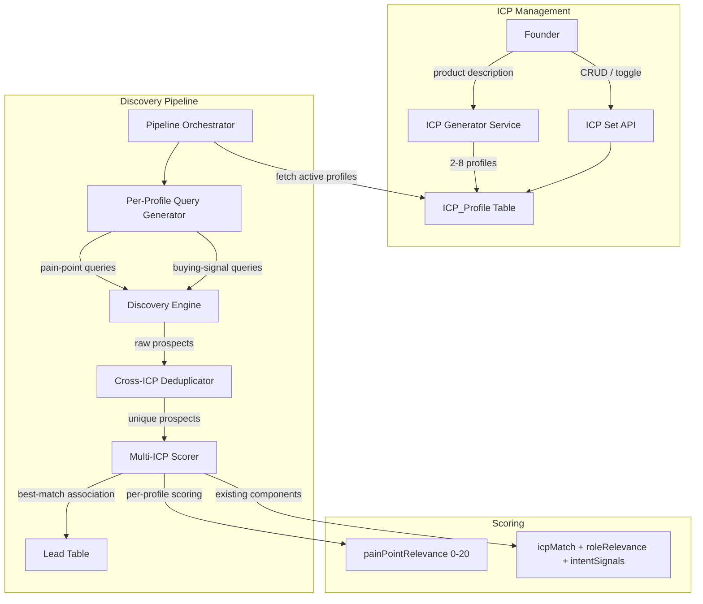

# Design Document: Multi-ICP Generation

## Overview

This design replaces the single-ICP-per-founder model with a multi-ICP system. When a founder describes their product, the AI generator produces an **ICP_Set** — a collection of 2–8 **ICP_Profile** records, each representing a distinct buyer persona with its own pain points and buying signals.

The discovery pipeline is updated to iterate across all active profiles, generate pain-point-aware search queries per profile, deduplicate prospects across profiles, and associate each lead with the best-matching ICP. The scoring service gains a new `painPointRelevance` component (0–20 points) that measures how closely a lead's context aligns with the originating profile's pain points.

Key changes:

- New `icp_profile` table replaces the `icp` table
- `lead` table gains an `icp_profile_id` foreign key
- Generator service produces multiple profiles from a single product description
- Query generator incorporates pain points and buying signals into search queries
- Discovery pipeline runs across all active profiles with global cap enforcement
- Scoring service adds `painPointRelevance` to the breakdown
- New API endpoints for ICP set management (CRUD, activate/deactivate, regenerate)
- Migration path from single ICP to multi-ICP with zero lead loss

## Architecture



### Data Flow

1. Founder submits product description → Generator calls OpenAI → returns 2–8 ICP_Profile records
2. Founder reviews and confirms → profiles saved to `icp_profile` table
3. Pipeline orchestrator fetches all active profiles for the founder
4. For each active profile, the query generator produces pain-point and buying-signal queries
5. Discovery engine executes all queries, tags results with originating profile ID
6. Cross-ICP deduplicator merges duplicates by normalized name+company
7. For duplicates found across profiles, the scorer evaluates against each matching profile and picks the highest
8. Lead is created with `icp_profile_id` pointing to the best-matching profile
9. Scoring includes the new `painPointRelevance` component

## Components and Interfaces

### 1. ICP Profile Service (`src/services/icpProfileService.ts`)

Replaces the current `icpService.ts` for multi-ICP operations. The existing `icpService.ts` is preserved for backward compatibility during migration but all new code uses the profile service.

```typescript
// --- Types ---

interface ICPProfile {
  id: string;
  founderId: string;
  targetRole: string;
  industry: string;
  companyStage?: string;
  geography?: string;
  painPoints: string[]; // 1–10 items, each ≤200 chars
  buyingSignals: string[]; // 1–5 items, each ≤200 chars
  customTags?: string[];
  isActive: boolean;
  createdAt: Date;
  updatedAt: Date;
}

interface ICPSet {
  founderId: string;
  profiles: ICPProfile[];
  activeCount: number;
}

interface ICPProfileValidationResult {
  valid: boolean;
  errors: string[];
}

// --- Functions ---

function validateICPProfile(input: Partial<ICPProfile>): ICPProfileValidationResult;
function validatePainPoints(painPoints: string[]): { valid: boolean; errors: string[] };
function validateBuyingSignals(signals: string[]): { valid: boolean; errors: string[] };

async function getICPSet(founderId: string): Promise<ICPSet>;
async function getActiveProfiles(founderId: string): Promise<ICPProfile[]>;
async function getICPProfileById(id: string): Promise<ICPProfile | null>;
async function createICPProfile(
  input: Omit<ICPProfile, 'id' | 'createdAt' | 'updatedAt'>,
): Promise<ICPProfile>;
async function updateICPProfile(id: string, input: Partial<ICPProfile>): Promise<ICPProfile | null>;
async function deleteICPProfile(id: string): Promise<boolean>;
async function setProfileActive(id: string, isActive: boolean): Promise<ICPProfile | null>;
async function replaceICPSet(
  founderId: string,
  profiles: Omit<ICPProfile, 'id' | 'createdAt' | 'updatedAt'>[],
): Promise<ICPSet>;
```

### 2. ICP Generator Service (`src/services/icpGeneratorService.ts`)

New service that calls OpenAI to produce multiple ICP profiles from a product description.

```typescript
interface GenerateICPSetResult {
  profiles: Omit<ICPProfile, 'id' | 'createdAt' | 'updatedAt'>[];
  productDescription: string;
}

async function generateICPSet(
  productDescription: string,
  founderId: string,
): Promise<GenerateICPSetResult>;
```

The generator:

- Validates the product description is non-empty/non-whitespace
- Calls OpenAI with a structured prompt requesting 2–8 personas
- Parses and validates the JSON response
- Clamps pain points to 2–10 per profile, buying signals to 1–5
- Ensures all targetRoles are distinct
- Returns the profiles without persisting (caller decides when to save)

### 3. Updated Query Generator (`src/services/discovery/queryGenerator.ts`)

Extended to accept an `ICPProfile` (with pain points and buying signals) and produce annotated queries.

```typescript
interface AnnotatedQueryV2 extends AnnotatedQuery {
  icpProfileId: string;
  sourceType: 'pain_point' | 'buying_signal' | 'base';
  sourceText?: string; // the pain point or buying signal text
}

interface QueryGeneratorResultV2 {
  queries: AnnotatedQueryV2[];
  generationMethod: 'ai' | 'template_fallback';
}

async function generateQueriesForProfile(
  profile: ICPProfile,
  config?: Partial<QueryGeneratorConfig>,
): Promise<QueryGeneratorResultV2>;
```

For each profile:

- Generate at least 1 query per pain point (combining pain point + targetRole + industry)
- Generate at least 1 query per buying signal
- Generate base queries (existing behavior) using targetRole, industry, geography
- Annotate each query with `icpProfileId`, `sourceType`, and `sourceText`
- Fall back to base queries if profile has no pain points

### 4. Updated Discovery Engine (`src/services/discovery/discoveryEngine.ts`)

Extended `discoverLeadsMultiICP` function that iterates across profiles.

```typescript
interface MultiICPDiscoveryResult {
  prospects: (DiscoveredLeadData & { icpProfileId: string; score: number })[];
  profileResults: Map<string, number>; // profileId → count discovered
}

async function discoverLeadsMultiICP(
  profiles: ICPProfile[],
  dailyCap: number,
): Promise<MultiICPDiscoveryResult>;
```

Logic:

1. Distribute cap proportionally: each profile gets `floor(dailyCap / profiles.length)` slots, remainder distributed round-robin
2. For each profile, generate queries via `generateQueriesForProfile`
3. Execute discovery across all queries
4. Tag each prospect with the originating `icpProfileId`
5. Deduplicate across profiles using `normalizeNameCompany`
6. For duplicates, score against each matching profile, keep the highest-scoring association
7. Enforce global cap across all profiles

### 5. Updated Scoring Service (`src/services/scoringService.ts`)

New score breakdown with `painPointRelevance`:

```typescript
interface ScoreBreakdownV2 {
  icpMatch: number; // 0–25 (reduced from 0–40)
  roleRelevance: number; // 0–25 (reduced from 0–30)
  intentSignals: number; // 0–30 (unchanged)
  painPointRelevance: number; // 0–20 (new)
}

interface ScoringInputV2 {
  lead: Pick<Lead, 'role' | 'industry' | 'geography' | 'company' | 'enrichmentData'>;
  icpProfile: ICPProfile;
}

function calculateLeadScoreV2(input: ScoringInputV2): ScoringOutput;
```

The `painPointRelevance` component:

- Analyzes the lead's enrichment data (linkedinBio, recentPosts, companyInfo) for mentions of the profile's pain points
- Uses keyword matching with normalization
- Awards up to 20 points based on the number of pain points matched and the quality of matches
- 0 points if no enrichment data or no pain point matches

Score redistribution: `icpMatch` reduced from 0–40 to 0–25, `roleRelevance` reduced from 0–30 to 0–25, to make room for the new 0–20 `painPointRelevance` component. Total remains 0–100.

### 6. Updated Pipeline Orchestrator (`src/services/pipelineOrchestratorService.ts`)

The `executeDiscoveryStage` function is updated to:

1. Fetch all active ICP profiles instead of a single ICP
2. Call `discoverLeadsMultiICP` instead of `discoverLeads`
3. Store `icp_profile_id` on each created lead
4. Use `calculateLeadScoreV2` for scoring

### 7. API Endpoints

| Method | Path                                 | Description                                         |
| ------ | ------------------------------------ | --------------------------------------------------- |
| GET    | `/api/icp/profiles?founderId=<uuid>` | Get all profiles for a founder (ICP_Set)            |
| GET    | `/api/icp/profiles/[id]`             | Get a single profile                                |
| POST   | `/api/icp/profiles`                  | Manually create a profile                           |
| PUT    | `/api/icp/profiles/[id]`             | Update a profile                                    |
| DELETE | `/api/icp/profiles/[id]`             | Delete a profile                                    |
| PATCH  | `/api/icp/profiles/[id]/active`      | Toggle active/inactive                              |
| POST   | `/api/icp/generate`                  | Generate ICP_Set from product description (updated) |
| POST   | `/api/icp/generate/confirm`          | Confirm and save a generated ICP_Set                |

The existing `/api/icp` endpoint is preserved for backward compatibility but marked deprecated.

### 8. Enrichment Service Updates (`src/services/enrichmentService.ts`)

The `discoverAndEnrichLeads` function is updated to:

1. Fetch all active ICP profiles
2. Call `discoverLeadsMultiICP`
3. Pass the originating `icpProfileId` through to lead creation and scoring

## Data Models

### New `icp_profile` Table

```sql
CREATE TABLE icp_profile (
  id             UUID PRIMARY KEY DEFAULT uuid_generate_v4(),
  founder_id     UUID NOT NULL REFERENCES founder(id),
  target_role    VARCHAR(255) NOT NULL,
  industry       VARCHAR(255) NOT NULL,
  company_stage  VARCHAR(255),
  geography      VARCHAR(255),
  pain_points    TEXT[] NOT NULL DEFAULT '{}',
  buying_signals TEXT[] NOT NULL DEFAULT '{}',
  custom_tags    TEXT[],
  is_active      BOOLEAN NOT NULL DEFAULT true,
  created_at     TIMESTAMPTZ NOT NULL DEFAULT NOW(),
  updated_at     TIMESTAMPTZ NOT NULL DEFAULT NOW(),

  CONSTRAINT chk_pain_points_length
    CHECK (array_length(pain_points, 1) IS NULL OR
           (array_length(pain_points, 1) >= 1 AND array_length(pain_points, 1) <= 10)),
  CONSTRAINT chk_buying_signals_length
    CHECK (array_length(buying_signals, 1) IS NULL OR
           (array_length(buying_signals, 1) >= 1 AND array_length(buying_signals, 1) <= 5))
);

CREATE INDEX idx_icp_profile_founder ON icp_profile (founder_id);
CREATE INDEX idx_icp_profile_active ON icp_profile (founder_id) WHERE is_active = true;
```

### Lead Table Additions

```sql
ALTER TABLE lead ADD COLUMN icp_profile_id UUID REFERENCES icp_profile(id) ON DELETE SET NULL;
CREATE INDEX idx_lead_icp_profile ON lead (icp_profile_id);
```

Using `ON DELETE SET NULL` ensures that when an ICP_Profile is deleted, leads are retained with a null `icp_profile_id` (satisfying Requirement 3.6). The scoring service handles null `icp_profile_id` by finding the best-matching active profile (Requirement 6.5).

### Migration Strategy

The migration runs in a single SQL migration file:

1. Create the `icp_profile` table
2. For each existing `icp` row, insert a corresponding `icp_profile` row copying `target_role`, `industry`, `company_stage`, `geography`, `custom_tags`, and setting `is_active = true`, `pain_points = COALESCE(pain_points_solved, '{}')`, `buying_signals = '{}'`
3. Add `icp_profile_id` column to `lead` table
4. Update existing leads: set `icp_profile_id` to the migrated profile for their founder
5. The old `icp` table is kept but no longer written to by new code (deprecated)

```sql
-- Step 1: Create icp_profile table
-- (DDL as above)

-- Step 2: Migrate existing ICP records
INSERT INTO icp_profile (id, founder_id, target_role, industry, company_stage, geography, pain_points, buying_signals, custom_tags, is_active)
SELECT id, founder_id, target_role, industry, company_stage, geography,
       COALESCE(pain_points_solved, '{}'), '{}', custom_tags, true
FROM icp;

-- Step 3: Add icp_profile_id to lead
ALTER TABLE lead ADD COLUMN icp_profile_id UUID REFERENCES icp_profile(id) ON DELETE SET NULL;

-- Step 4: Backfill lead.icp_profile_id from founder's migrated profile
UPDATE lead l
SET icp_profile_id = (
  SELECT ip.id FROM icp_profile ip
  WHERE ip.founder_id = l.founder_id
  ORDER BY ip.created_at ASC
  LIMIT 1
);

-- Step 5: Index
CREATE INDEX idx_lead_icp_profile ON lead (icp_profile_id);
```

### Updated Type Definitions (`src/types/index.ts`)

```typescript
interface ICPProfile {
  id: string;
  founderId: string;
  targetRole: string;
  industry: string;
  companyStage?: string;
  geography?: string;
  painPoints: string[];
  buyingSignals: string[];
  customTags?: string[];
  isActive: boolean;
  createdAt: Date;
  updatedAt: Date;
}

interface ScoreBreakdownV2 {
  icpMatch: number; // 0–25
  roleRelevance: number; // 0–25
  intentSignals: number; // 0–30
  painPointRelevance: number; // 0–20
}
```

The existing `ICP` and `ScoreBreakdown` types are preserved for backward compatibility. New code uses `ICPProfile` and `ScoreBreakdownV2`.

## Correctness Properties

_A property is a characteristic or behavior that should hold true across all valid executions of a system — essentially, a formal statement about what the system should do. Properties serve as the bridge between human-readable specifications and machine-verifiable correctness guarantees._

### Property 1: ICP_Set generation bounds and uniqueness

_For any_ non-empty, non-whitespace product description, the generator SHALL produce an ICP_Set containing between 2 and 8 ICP_Profile records, each with a distinct `targetRole`.

**Validates: Requirements 1.1, 1.2**

### Property 2: Generated profile field completeness and bounds

_For any_ ICP_Profile produced by the generator, the profile SHALL have a non-empty `industry`, a `painPoints` array with 2–10 entries, and a `buyingSignals` array with 1–5 entries.

**Validates: Requirements 1.3, 1.4, 1.5, 2.1**

### Property 3: Whitespace product description rejection

_For any_ string composed entirely of whitespace characters (including empty string), the generator SHALL return a validation error and produce zero ICP_Profile records.

**Validates: Requirements 1.6**

### Property 4: Pain points validation

_For any_ array of strings, the pain points validator SHALL accept arrays with 1–10 entries where each entry is non-empty and ≤200 characters, and reject all others.

**Validates: Requirements 2.2**

### Property 5: Buying signals validation

_For any_ array of strings, the buying signals validator SHALL accept arrays with 1–5 entries where each entry is non-empty and ≤200 characters, and reject all others.

**Validates: Requirements 2.3**

### Property 6: Manual ICP_Profile creation validation

_For any_ ICP_Profile input, the validator SHALL reject inputs missing `targetRole`, `industry`, or having zero `painPoints`, and accept inputs where all three are present and valid.

**Validates: Requirements 3.5**

### Property 7: Active profile filtering

_For any_ ICP_Set containing a mix of active and inactive profiles, retrieving active profiles SHALL return only those with `isActive = true`, and the count SHALL equal the number of profiles where `isActive = true`.

**Validates: Requirements 3.3, 4.1**

### Property 8: Activate/deactivate round trip

_For any_ ICP_Profile, deactivating it (setting `isActive = false`) and then activating it (setting `isActive = true`) SHALL result in the profile being included in the active profiles set.

**Validates: Requirements 3.4**

### Property 9: ICP_Set retrieval ordering

_For any_ founder's ICP_Set with multiple profiles, the returned list SHALL be ordered by `createdAt` ascending — that is, for every consecutive pair of profiles in the result, the first profile's `createdAt` is ≤ the second's.

**Validates: Requirements 3.1**

### Property 10: Cross-ICP prospect deduplication

_For any_ list of discovered prospects from multiple ICP_Profiles, after deduplication by normalized name+company, no two prospects in the output SHALL share the same normalized name+company key.

**Validates: Requirements 4.4**

### Property 11: Best-score ICP association

_For any_ prospect that matches multiple ICP_Profiles, the lead SHALL be associated with the ICP_Profile that produces the highest score from the scoring service. That is, for all other matching profiles, the associated profile's score is ≥ their score.

**Validates: Requirements 4.5**

### Property 12: Global daily discovery cap enforcement

_For any_ pipeline run with N active profiles and a daily cap of C, the total number of newly discovered leads across all profiles SHALL not exceed C.

**Validates: Requirements 4.6**

### Property 13: Pain-point query generation

_For any_ ICP_Profile with P pain points (P ≥ 1), the query generator SHALL produce at least P queries where each query's `sourceType` is `'pain_point'` and the query text incorporates the pain point text combined with the profile's `targetRole` and `industry`.

**Validates: Requirements 5.1, 5.2**

### Property 14: Buying-signal query generation

_For any_ ICP_Profile with B buying signals (B ≥ 1), the query generator SHALL produce at least B queries where each query's `sourceType` is `'buying_signal'`.

**Validates: Requirements 5.3**

### Property 15: Query annotation completeness

_For any_ query generated from a pain point or buying signal, the query SHALL be annotated with the originating `icpProfileId` and the `sourceText` matching the pain point or buying signal it targets.

**Validates: Requirements 5.4**

### Property 16: painPointRelevance scoring bounds

_For any_ scoring input (lead + ICP_Profile), the `painPointRelevance` component of the score breakdown SHALL be an integer in the range [0, 20].

**Validates: Requirements 6.2**

## Error Handling

| Scenario                                       | Behavior                                                                               |
| ---------------------------------------------- | -------------------------------------------------------------------------------------- |
| Empty/whitespace product description           | Return 400 with validation error, no profiles created                                  |
| OpenAI failure during generation               | Return 502, preserve existing ICP_Set, include error message                           |
| OpenAI returns invalid JSON                    | Retry once, then return 502 with parse error details                                   |
| OpenAI returns < 2 profiles                    | Retry once with adjusted prompt, then return 502 if still insufficient                 |
| Pain point exceeds 200 chars                   | Truncate to 200 chars during generation; reject via validation on manual create/update |
| Profile not found on update/delete             | Return 404                                                                             |
| Unauthorized access (wrong founderId)          | Return 403                                                                             |
| Database constraint violation on create        | Return 409 with conflict details                                                       |
| Deleted ICP_Profile referenced during re-score | Fall back to best-matching active profile (Req 6.5)                                    |
| No active profiles during pipeline run         | Skip discovery stage, log warning                                                      |
| Daily cap already reached                      | Return 0 prospects, log info                                                           |

## Testing Strategy

### Property-Based Tests (using `fast-check`)

Each correctness property above maps to a property-based test with minimum 100 iterations. Tests use `fast-check` (already in devDependencies).

- **Generator output tests**: Mock OpenAI responses with `fast-check` arbitraries to produce varied profile sets, verify bounds and uniqueness (Properties 1–3)
- **Validation tests**: Generate random string arrays, verify accept/reject behavior matches spec (Properties 4–6)
- **Active filtering tests**: Generate random profile sets with mixed `isActive`, verify filtering (Properties 7–8)
- **Ordering tests**: Generate random profile sets, verify retrieval order (Property 9)
- **Deduplication tests**: Generate prospect lists with controlled duplicates, verify output uniqueness (Property 10)
- **Best-score association tests**: Generate prospects with multiple profile matches, verify highest-score wins (Property 11)
- **Cap enforcement tests**: Generate pipeline scenarios with varying profile counts and caps, verify total ≤ cap (Property 12)
- **Query generation tests**: Generate profiles with varying pain points and buying signals, verify query counts and content (Properties 13–15)
- **Scoring bounds tests**: Generate random scoring inputs, verify `painPointRelevance` ∈ [0, 20] (Property 16)

Tag format: `Feature: multi-icp-generation, Property {N}: {title}`

### Unit Tests (example-based)

- AI failure preserves existing ICP_Set (Req 1.7)
- `isActive` defaults to `true` on creation (Req 2.4)
- `founderId` association on creation (Req 2.5)
- Profile update persists changes and updates timestamp (Req 3.2)
- Profile deletion retains associated leads (Req 3.6)
- Query generation falls back to base queries when no pain points (Req 5.5)
- Scoring uses originating ICP_Profile (Req 6.1)
- ICP_Profile ID stored on lead record (Req 6.3)
- Re-scoring uses originating profile (Req 6.4)
- Deleted profile fallback scoring (Req 6.5)
- Regeneration produces new set (Req 7.1)
- Replacement on confirmation (Req 7.2)
- Pending set doesn't affect pipeline (Req 7.3)

### Integration Tests

- Lead retention after ICP_Set replacement (Req 7.4)
- Re-scoring triggered after replacement (Req 7.5)
- Full pipeline run with multiple active profiles end-to-end
- Migration from single ICP to multi-ICP preserves data
