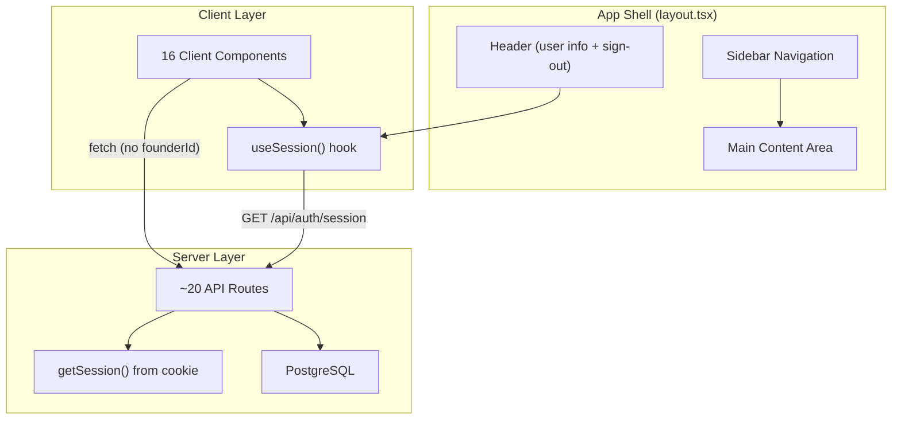

# Design Document: Multi-Tenant UI Overhaul

## Overview

This design covers two intertwined concerns for the SignalFlow GTM Engine:

1. **Multi-tenant session scoping** — Replace the hardcoded `FOUNDER_ID` constant with session-derived identity on both client and server, ensuring each authenticated user sees only their own data.
2. **UI modernization** — Replace ~2800 lines of custom CSS and the flat horizontal tab bar with a shadcn/ui + Tailwind CSS design system and a sidebar-based app shell layout.

The existing auth infrastructure (ConsentKeys OIDC, encrypted session cookie, `getSession()`, middleware protection) is already in place. The work is primarily a refactoring and migration effort — no new auth flows are needed.

### Key Design Decisions

- **Client-side session hook (`useSession`)** fetches from the existing `GET /api/auth/session` endpoint rather than introducing a React Context provider. This keeps the implementation simple and avoids prop-drilling a provider through the layout. Components call the hook directly.
- **Server-side API routes** call `getSession()` directly and ignore any client-supplied `founderId`. This is a security hardening step — the client no longer sends `founderId` at all.
- **shadcn/ui** is chosen because it provides accessible, composable primitives built on Radix UI, styled with Tailwind CSS. It integrates naturally with the existing Next.js App Router setup.
- **Sidebar navigation** replaces the 9-tab horizontal bar. The sidebar collapses on viewports below 768px into a toggleable mobile menu.

## Architecture

### High-Level Component Architecture



### Session Flow (Before vs After)

**Before:**

```
Component → import FOUNDER_ID → fetch(/api/foo?founderId=HARDCODED) → API reads query param → DB query
```

**After:**

```
Component → useSession() → fetch(/api/foo) → API calls getSession() → extracts founderId from cookie → DB query
```

### Navigation Architecture (Before vs After)

**Before:** Single `page.tsx` with a `useState<Tab>` controlling which component renders. All 9 sections live in one page with a horizontal tab bar.

**After:** Each section becomes a route under the app shell layout. The sidebar provides navigation links. The app shell is a shared layout component wrapping all authenticated routes.

```
src/app/
├── (app)/                    # Route group for authenticated pages
│   ├── layout.tsx            # App shell: Sidebar + Header + main
│   ├── dashboard/page.tsx
│   ├── leads/page.tsx
│   ├── pipeline/page.tsx
│   ├── messages/page.tsx
│   ├── outreach/page.tsx
│   ├── insights/page.tsx
│   ├── icp/page.tsx
│   ├── throttle/page.tsx
│   └── autopilot/page.tsx
├── login/page.tsx            # Public login page (no app shell)
└── layout.tsx                # Root layout (fonts, global CSS)
```

## Components and Interfaces

### 1. `useSession` Hook

**File:** `src/hooks/useSession.ts`

```typescript
interface SessionData {
  founderId: string;
  name: string | null;
  email: string | null;
}

interface UseSessionReturn {
  session: SessionData | null;
  isLoading: boolean;
  error: string | null;
}

function useSession(): UseSessionReturn;
```

**Behavior:**

- On mount, fetches `GET /api/auth/session`.
- While loading: `{ session: null, isLoading: true, error: null }`.
- On 401: redirects to `/login` via `window.location.href = '/login'`.
- On success: populates `session` with `{ founderId, name, email }`.
- On network error: sets `error` to a descriptive message, `isLoading` to `false`.
- Caches the result in a module-level variable so multiple components calling `useSession()` in the same render tree share a single fetch (SWR-like deduplication using a shared promise).

### 2. App Shell Layout

**File:** `src/app/(app)/layout.tsx`

```typescript
interface AppShellProps {
  children: React.ReactNode;
}
```

Renders:

- `<Sidebar />` — vertical nav on the left
- `<Header />` — top bar with "SignalFlow" branding, user name, sign-out
- `<main>` — children (page content)

### 3. Sidebar Component

**File:** `src/components/Sidebar.tsx`

```typescript
interface NavItem {
  label: string;
  href: string;
  icon: React.ReactNode;
}

interface SidebarProps {
  isOpen: boolean;
  onToggle: () => void;
}
```

Navigation items:
| Label | Route | Icon |
|-------|-------|------|
| Dashboard | `/dashboard` | LayoutDashboard |
| Leads | `/leads` | Users |
| Pipeline | `/pipeline` | Kanban |
| Messages | `/messages` | MessageSquare |
| Outreach | `/outreach` | Send |
| Insights | `/insights` | Lightbulb |
| ICP | `/icp` | Target |
| Throttle | `/throttle` | Gauge |
| Autopilot | `/autopilot` | Bot |

Uses `usePathname()` from `next/navigation` to highlight the active item. On viewports < 768px, the sidebar is hidden by default and toggled via a hamburger button in the Header.

### 4. Header Component

**File:** `src/components/Header.tsx`

```typescript
interface HeaderProps {
  onMenuToggle: () => void;
}
```

Displays:

- Mobile menu toggle button (visible < 768px)
- "SignalFlow" text
- User display name (falls back to email) from `useSession()`
- Sign-out link → `/api/auth/logout`

### 5. Refactored Client Components

All 16 components that currently import `FOUNDER_ID` will be updated to:

1. Call `useSession()` at the top of the component.
2. Guard on `isLoading` — render a skeleton/spinner while session loads.
3. Use `session.founderId` in all API fetch calls.
4. Remove the `founderId` query parameter / body field from fetch calls (API routes will derive it server-side).

**Example refactored pattern:**

```typescript
export default function DashboardSummary() {
  const { session, isLoading: sessionLoading } = useSession();

  // ... existing state ...

  const fetchSummary = useCallback(async () => {
    if (!session) return;
    const res = await fetch('/api/dashboard/summary');
    // ...
  }, [session]);

  if (sessionLoading) return <Skeleton className="h-64" />;
  // ... rest of component
}
```

### 6. Refactored API Routes

All ~20 API routes that accept `founderId` from the client will be updated to:

1. Call `getSession()` at the start of the handler.
2. Return 401 if session is null.
3. Use `session.founderId` for all database queries.
4. Ignore any client-supplied `founderId`.

**Example refactored pattern:**

```typescript
import { getSession } from '@/lib/auth';

export async function GET() {
  const session = await getSession();
  if (!session) {
    return NextResponse.json({ error: 'Unauthorized' }, { status: 401 });
  }

  const summary = await getWeeklySummary(session.founderId);
  return NextResponse.json(summary);
}
```

### 7. shadcn/ui Component Mapping

| Current Custom Element                                | shadcn/ui Replacement          |
| ----------------------------------------------------- | ------------------------------ |
| `.action-btn`, `.login-btn`                           | `<Button>`                     |
| `<input>`, `<textarea>`                               | `<Input>`, `<Textarea>`        |
| `<select>`                                            | `<Select>`                     |
| `.metric-card`, `.pipeline-card`, `.icp-preview-card` | `<Card>`                       |
| `.lead-table`                                         | `<Table>`                      |
| `.tab`, `.pipeline-nav`                               | `<Tabs>`                       |
| `.status-badge`                                       | `<Badge>`                      |
| `.toast`                                              | Sonner `<Toaster>` + `toast()` |
| `.form-feedback.error` (login)                        | `<Alert>`                      |
| `.login-card`                                         | `<Card>`                       |
| `.dashboard-loading`, `.pipeline-loading`             | `<Skeleton>`                   |
| `.icp-preview-section` (confirm dialog)               | `<Dialog>`                     |

### 8. Login Page

**File:** `src/app/login/page.tsx`

Redesigned with shadcn/ui:

- Centered `<Card>` with `<CardHeader>` ("SignalFlow" + tagline)
- `<CardContent>` with `<Button>` linking to `/api/auth/login`
- Error display via `<Alert variant="destructive">` when `?error=` param present
- Tailwind utility classes for centering: `flex min-h-screen items-center justify-center`

## Data Models

No new database tables or schema changes are required. The existing `founder` table already has the `oidc_sub` column for user mapping, and all data tables already have `founder_id` foreign keys.

### Session Data (existing, unchanged)

```typescript
interface UserSession {
  sub: string; // OIDC subject identifier
  email?: string;
  name?: string;
  founderId: string; // UUID from founder table
  accessToken: string;
  refreshToken?: string;
  expiresAt: number; // Unix timestamp
}
```

### Client-Side Session (new, subset exposed to client)

```typescript
interface SessionData {
  founderId: string;
  name: string | null;
  email: string | null;
}
```

This is the shape returned by `GET /api/auth/session` (already exists) and consumed by the `useSession` hook. The `accessToken`, `refreshToken`, and `sub` fields are intentionally excluded from the client-facing response.

### shadcn/ui Configuration

**`components.json`** (project root):

```json
{
  "$schema": "https://ui.shadcn.com/schema.json",
  "style": "new-york",
  "rsc": true,
  "tsx": true,
  "tailwind": {
    "config": "tailwind.config.ts",
    "css": "src/app/globals.css",
    "baseColor": "zinc",
    "cssVariables": true
  },
  "aliases": {
    "components": "@/components/ui",
    "utils": "@/lib/utils",
    "hooks": "@/hooks"
  }
}
```

**`src/lib/utils.ts`:**

```typescript
import { clsx, type ClassValue } from 'clsx';
import { twMerge } from 'tailwind-merge';

export function cn(...inputs: ClassValue[]) {
  return twMerge(clsx(inputs));
}
```

## Correctness Properties

_A property is a characteristic or behavior that should hold true across all valid executions of a system — essentially, a formal statement about what the system should do. Properties serve as the bridge between human-readable specifications and machine-verifiable correctness guarantees._

### Property 1: Session hook faithfully maps API response

_For any_ valid session API response containing a `founderId` (UUID string), `name` (string or null), and `email` (string or null), the `useSession` hook SHALL populate its returned `session` object with exactly those values, preserving the `founderId`, `name`, and `email` without transformation.

**Validates: Requirements 1.4**

### Property 2: Client components never send founderId in API requests

_For any_ client component that makes API calls and _for any_ session state, the outgoing fetch requests SHALL NOT include a `founderId` query parameter or body field. The component relies on the server to derive founderId from the session.

**Validates: Requirements 2.4**

### Property 3: API routes use session-derived founderId, ignoring client-supplied values

_For any_ authenticated API route and _for any_ pair of (session founderId, client-supplied founderId), the route SHALL use only the session-derived founderId for database queries, and the response SHALL contain only data belonging to the session founderId — regardless of what founderId the client supplies in query parameters or request body.

**Validates: Requirements 3.1, 3.3, 3.4**

### Property 4: Unauthenticated API requests receive 401

_For any_ API route that requires authentication, _for any_ request without a valid session cookie, the route SHALL return HTTP 401 with a JSON body containing `{ "error": "Unauthorized" }`.

**Validates: Requirements 3.2**

## Error Handling

### Session Errors (Client-Side)

| Scenario                                                      | Behavior                                              |
| ------------------------------------------------------------- | ----------------------------------------------------- |
| `GET /api/auth/session` returns 401                           | `useSession` redirects to `/login`                    |
| `GET /api/auth/session` network failure                       | `useSession` sets `error` message, `isLoading: false` |
| Session expired (cookie still present but `expiresAt` passed) | Server returns 401 → same as above                    |

### API Route Errors (Server-Side)

| Scenario                                    | Response                                               |
| ------------------------------------------- | ------------------------------------------------------ |
| No session cookie                           | 401 `{ "error": "Unauthorized" }`                      |
| Session cookie present but decryption fails | 401 `{ "error": "Unauthorized" }`                      |
| Session expired                             | 401 `{ "error": "Unauthorized" }`                      |
| Valid session but database error            | 500 with appropriate error message (existing behavior) |

### Component Error States

All data-fetching components follow a consistent pattern:

1. **Loading** — Show `<Skeleton>` placeholder while `useSession` or data fetch is in-flight.
2. **Error** — Show shadcn/ui `<Alert variant="destructive">` with error message and a "Retry" `<Button>`.
3. **Empty** — Show a descriptive message with a call-to-action where applicable (e.g., "No leads yet. Add your first lead.").

### Login Page Errors

When the URL contains an `?error=` query parameter (e.g., after a failed OIDC callback), the login page displays the decoded error message in a `<Alert variant="destructive">`.

## Testing Strategy

### Unit Tests (Example-Based)

Unit tests cover specific scenarios and UI behavior:

- **`useSession` hook**: Test loading state, successful response mapping, 401 redirect, network error handling (Requirements 1.1–1.5)
- **Sidebar**: Verify all 9 nav items render, active item highlighting based on pathname (Requirements 6.1–6.2)
- **Header**: Verify user name display, email fallback, sign-out link (Requirements 7.1–7.3)
- **Login page**: Verify card content, button link, error display (Requirements 8.1–8.5)
- **Component loading guards**: Each refactored component shows skeleton when session is loading (Requirement 2.3)
- **Component empty/error states**: Each component handles empty data and fetch failures (Requirements 9.1–9.3)

### Property-Based Tests

Property-based tests verify universal properties using `fast-check` (already in devDependencies):

- **Property 1** — Generate random valid session payloads, verify `useSession` maps them correctly. Min 100 iterations. Tag: `Feature: multi-tenant-ui-overhaul, Property 1: Session hook faithfully maps API response`
- **Property 2** — Generate random session states and component renders, verify no outgoing fetch includes `founderId`. Min 100 iterations. Tag: `Feature: multi-tenant-ui-overhaul, Property 2: Client components never send founderId in API requests`
- **Property 3** — Generate random (session founderId, attacker founderId) pairs, call API routes, verify response data is scoped to session founderId only. Min 100 iterations. Tag: `Feature: multi-tenant-ui-overhaul, Property 3: API routes use session-derived founderId ignoring client-supplied values`
- **Property 4** — For each authenticated API route, call without session cookie, verify 401 response. Min 100 iterations. Tag: `Feature: multi-tenant-ui-overhaul, Property 4: Unauthenticated API requests receive 401`

### Smoke Tests

- Verify `tailwindcss` is in `package.json` dependencies (Requirement 4.1)
- Verify `tailwind.config.ts` exists with correct content paths (Requirement 4.2)
- Verify `components.json` exists at project root (Requirement 4.3)
- Verify `src/lib/utils.ts` exports `cn()` (Requirement 4.4)
- Verify `globals.css` contains shadcn/ui CSS variables (Requirement 4.5)
- Verify zero imports of `FOUNDER_ID` in client components (Requirement 2.1)
- Verify superseded custom CSS rules are removed from `globals.css` (Requirement 5.9)

### Integration Tests

- End-to-end flow: Login → session established → navigate to dashboard → verify data loads for correct user
- API route integration: Call routes with valid session, verify correct data returned
- Responsive layout: Verify sidebar collapse behavior at different viewport widths (Requirements 10.1–10.4)
