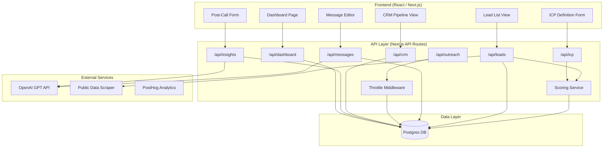
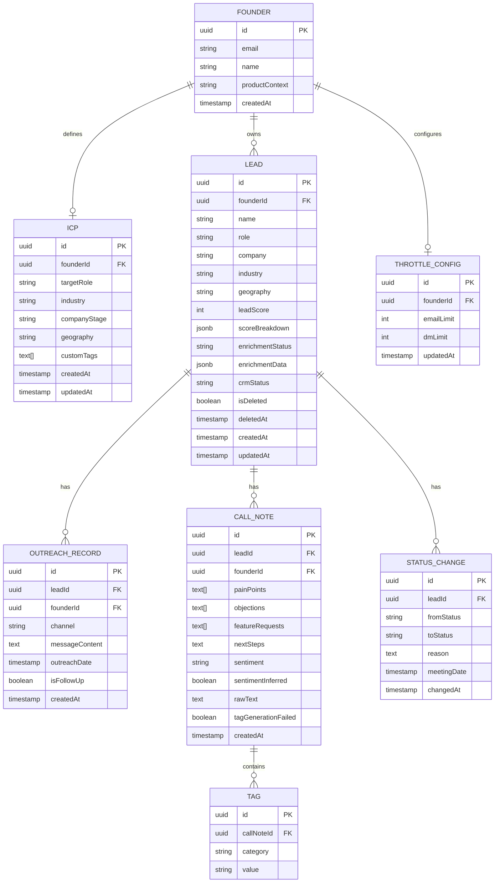

# Design Document: SignalFlow GTM Intelligence Engine

## Overview

SignalFlow is a full-stack web application that helps early-stage founders systematically discover prospects, generate personalized outreach, track conversations, and extract structured insights from customer interactions. The MVP delivers five core capabilities: lead management with scoring, AI-powered message generation, manual outreach tracking, a simple CRM pipeline, and post-call insight capture.

The system is built as a Next.js application with a React frontend, a Node.js API layer (Next.js API routes), a Postgres database for persistence, PostHog for product analytics, and an LLM integration (OpenAI GPT) for message generation and insight extraction.

### Key Design Decisions

1. **Next.js monorepo**: Both frontend and API routes live in a single Next.js project, reducing deployment complexity for an MVP.
2. **Server-side scoring**: Lead scoring runs on the backend so that ICP updates trigger batch recalculation without client involvement.
3. **LLM as a service**: Message generation and insight extraction call OpenAI's API rather than hosting a model, keeping infrastructure simple.
4. **Soft deletes**: All destructive operations use soft deletes with a 30-day retention window, per Requirement 10.5.
5. **Rate limiting at the application layer**: Throttle limits are enforced in the API, not at the database level, for flexibility and configurability.

## Architecture



### Request Flow

1. The founder interacts with React components in the browser.
2. Components call Next.js API routes over HTTP.
3. API routes execute business logic (scoring, throttle checks, LLM calls) and read/write Postgres.
4. LLM calls are made server-side to OpenAI for message generation and insight extraction.
5. PostHog is instrumented on the client for product analytics events.

## Components and Interfaces

### 1. ICP Service

Manages ICP definitions and triggers score recalculation.

```typescript
interface ICP {
  id: string;
  founderId: string;
  targetRole: string; // required
  industry: string; // required
  companyStage?: string;
  geography?: string;
  customTags?: string[];
  createdAt: Date;
  updatedAt: Date;
}

// POST /api/icp — create or update ICP
// Returns: ICP object
// Side effect: enqueues Lead_Score recalculation for all leads

// GET /api/icp — get current ICP
// Returns: ICP object
```

### 2. Lead Service

Handles lead discovery, manual entry, enrichment, and CRUD.

```typescript
interface Lead {
  id: string;
  founderId: string;
  name: string;
  role: string;
  company: string;
  industry?: string;
  geography?: string;
  leadScore: number; // 1–100
  scoreBreakdown: ScoreBreakdown;
  enrichmentStatus: "pending" | "complete" | "partial";
  enrichmentData?: EnrichmentData;
  crmStatus: CRMStatus;
  isDeleted: boolean;
  deletedAt?: Date;
  createdAt: Date;
  updatedAt: Date;
}

interface ScoreBreakdown {
  icpMatch: number; // 0–40
  roleRelevance: number; // 0–30
  intentSignals: number; // 0–30
}

interface EnrichmentData {
  linkedinBio?: string;
  recentPosts?: string[];
  companyInfo?: string;
  failedSources?: string[];
}

type CRMStatus = "New" | "Contacted" | "Replied" | "Booked" | "Closed";

// POST /api/leads/discover — trigger discovery from public sources
// POST /api/leads — manual lead entry
// GET /api/leads?minScore=N&sortBy=score — list with filters
// GET /api/leads/:id — single lead with full detail
// PATCH /api/leads/:id — update lead
// DELETE /api/leads/:id — soft delete
// POST /api/leads/:id/restore — restore soft-deleted lead
```

### 3. Scoring Service

Pure function that computes Lead_Score from ICP and lead data.

```typescript
interface ScoringInput {
  lead: Pick<
    Lead,
    "role" | "industry" | "geography" | "company" | "enrichmentData"
  >;
  icp: ICP;
}

interface ScoringOutput {
  totalScore: number; // 1–100
  breakdown: ScoreBreakdown;
}

function calculateLeadScore(input: ScoringInput): ScoringOutput;

// Batch recalculation endpoint (internal, triggered by ICP update)
// POST /api/leads/recalculate
```

### 4. Message Generator Service

Produces personalized outreach messages via LLM.

```typescript
type MessageType = "cold_email" | "cold_dm";
type TonePreference = "professional" | "casual" | "direct";

interface MessageRequest {
  leadId: string;
  messageType: MessageType;
  tone: TonePreference;
  productContext: string;
}

interface MessageResponse {
  message: string;
  personalizationDetails: string[]; // which enrichment details were used
  limitedPersonalization: boolean; // true if enrichment data was insufficient
}

// POST /api/messages/generate — generate a message
// Returns: MessageResponse with editable message text
```

### 5. Outreach Tracking Service

Records outreach activities with throttle enforcement.

```typescript
interface OutreachRecord {
  id: string;
  leadId: string;
  founderId: string;
  channel: "email" | "dm";
  messageContent: string;
  outreachDate: Date;
  isFollowUp: boolean;
  createdAt: Date;
}

// POST /api/outreach — record an outreach action (throttle-checked)
// GET /api/outreach/:leadId — get outreach history for a lead
// GET /api/outreach/stale — leads contacted 7+ days ago with no reply
```

### 6. CRM Pipeline Service

Manages lead status transitions.

```typescript
interface StatusChange {
  id: string;
  leadId: string;
  fromStatus: CRMStatus;
  toStatus: CRMStatus;
  reason?: string; // required for backward moves
  meetingDate?: Date; // required when moving to 'Booked'
  changedAt: Date;
}

// PATCH /api/crm/:leadId/status — change CRM status
// GET /api/crm/pipeline — get all leads grouped by status with counts
// GET /api/crm/pipeline?status=X&minScore=N&lastActivityAfter=DATE — filtered
```

### 7. Insight Extractor Service

Captures and structures post-call notes.

```typescript
interface CallNote {
  id: string;
  leadId: string;
  founderId: string;
  painPoints: string[];
  objections: string[];
  featureRequests: string[];
  nextSteps: string;
  sentiment: "positive" | "neutral" | "negative";
  sentimentInferred: boolean; // true if LLM inferred sentiment
  rawText: string;
  tags: Tag[];
  tagGenerationFailed: boolean;
  createdAt: Date;
}

interface Tag {
  category: "pain_point" | "objection" | "feature_request";
  value: string;
}

// POST /api/insights/:leadId — submit a call note
// GET /api/insights/:leadId — get call notes for a lead (reverse chronological)
// GET /api/insights/aggregate — aggregated view of top pain points, objections, feature requests
```

### 8. Throttle Service

Enforces daily outreach rate limits.

```typescript
interface ThrottleConfig {
  founderId: string;
  emailLimit: number; // 5–50, default 20
  dmLimit: number; // 5–50, default 20
}

interface ThrottleStatus {
  channel: "email" | "dm";
  used: number;
  limit: number;
  remaining: number;
  warningThreshold: boolean; // true when >= 80% used
}

// GET /api/throttle/status — current usage for today
// PUT /api/throttle/config — update throttle limits
```

### 9. Dashboard Service

Aggregates metrics and summaries.

```typescript
interface WeeklySummary {
  leadsContacted: number;
  replyRate: number; // percentage
  meetingsBooked: number;
  conversionRate: number; // meetings → next step
  statusCounts: Record<CRMStatus, number>;
  upcomingMeetings: UpcomingMeeting[];
  highPrioritySuggestions: Lead[]; // score > 80, not contacted
  lowMeetingPrompt?: LeadSuggestion[]; // shown when < 3 meetings this week
}

interface UpcomingMeeting {
  leadName: string;
  date: Date;
  time: string;
}

// GET /api/dashboard/summary — weekly summary + metrics
```

## Data Models

### Entity-Relationship Diagram



### Postgres Schema Notes

- **Duplicate prevention** (Req 10.4): A unique index on `LOWER(name), LOWER(company)` per `founderId` on the `LEAD` table, filtered to `isDeleted = false`.
- **Soft deletes** (Req 10.5): `isDeleted` boolean + `deletedAt` timestamp. A scheduled job purges records older than 30 days.
- **Score breakdown**: Stored as JSONB for flexibility; the scoring algorithm may evolve.
- **Outreach counting**: Daily throttle checks query `OUTREACH_RECORD` with `outreachDate >= start_of_today` grouped by channel.
- **Indexes**: On `leadScore DESC` for sorted listing, on `crmStatus` for pipeline views, on `createdAt` for chronological queries, and on `leadId` for all child tables.

## Correctness Properties

_A property is a characteristic or behavior that should hold true across all valid executions of a system — essentially, a formal statement about what the system should do. Properties serve as the bridge between human-readable specifications and machine-verifiable correctness guarantees._

### Property 1: ICP validation and error reporting

_For any_ ICP input object with an arbitrary combination of present and missing fields, the validation function SHALL reject the input if and only if `targetRole` or `industry` is missing, and the returned error message SHALL list exactly the names of the missing required fields.

**Validates: Requirements 1.2, 1.5**

### Property 2: Lead score invariants

_For any_ valid lead and ICP pair, `calculateLeadScore` SHALL return a `totalScore` in the range [1, 100], and the `scoreBreakdown` SHALL contain `icpMatch` (0–40), `roleRelevance` (0–30), and `intentSignals` (0–30) such that `icpMatch + roleRelevance + intentSignals == totalScore`.

**Validates: Requirements 3.1, 3.5**

### Property 3: Lead list default sort order

_For any_ list of leads returned by the default query (no explicit sort override), the leads SHALL be ordered by `leadScore` in descending order — that is, for every consecutive pair, the earlier lead's score is greater than or equal to the later lead's score.

**Validates: Requirements 3.2**

### Property 4: Lead list minimum score filter

_For any_ list of leads and any minimum score threshold `N`, filtering the list by minimum score SHALL return exactly those leads whose `leadScore >= N`, and no lead with `leadScore < N` SHALL appear in the result.

**Validates: Requirements 3.3**

### Property 5: Limited personalization flag

_For any_ lead with enrichment data, the `limitedPersonalization` flag SHALL be `true` if and only if the lead's `EnrichmentData` lacks all of: `linkedinBio`, `recentPosts`, and `companyInfo` (i.e., none of the personalization sources have usable content).

**Validates: Requirements 4.6**

### Property 6: Message word count limits

_For any_ generated outreach message, if the `messageType` is `cold_dm` then the message SHALL contain 150 words or fewer, and if the `messageType` is `cold_email` then the message SHALL contain 250 words or fewer.

**Validates: Requirements 4.7**

### Property 7: Outreach history chronological order

_For any_ lead's outreach history, the records SHALL be ordered chronologically by `outreachDate` — that is, for every consecutive pair, the earlier record's date is less than or equal to the later record's date.

**Validates: Requirements 5.2**

### Property 8: Stale outreach filter

_For any_ set of leads with outreach records, the stale outreach filter SHALL return exactly those leads whose most recent outreach is older than 7 days AND whose `crmStatus` is not in `{Replied, Booked, Closed}`.

**Validates: Requirements 5.4**

### Property 9: Throttle enforcement

_For any_ founder, channel, and day, given a throttle limit `L` and a current outreach count `C` for that channel today: the system SHALL set `warningThreshold = true` when `C >= 0.8 * L`, and SHALL reject new outreach recording when `C >= L`.

**Validates: Requirements 5.5, 9.2, 9.3**

### Property 10: Throttle limit range validation

_For any_ integer value proposed as a throttle limit, the system SHALL accept the value if and only if it is in the range [5, 50] inclusive. Values outside this range SHALL be rejected with an appropriate error message.

**Validates: Requirements 9.4, 9.5**

### Property 11: CRM status aggregate counts

_For any_ set of non-deleted leads, the aggregate count for each `CRMStatus` SHALL equal the actual number of leads with that status — that is, `sum(counts) == total non-deleted leads`.

**Validates: Requirements 6.3, 8.2**

### Property 12: Pipeline multi-filter correctness

_For any_ combination of pipeline filters (CRM status, minimum score, maximum score, last activity date), every lead in the result set SHALL satisfy all active filter criteria, and no lead excluded from the result set SHALL satisfy all active filter criteria simultaneously.

**Validates: Requirements 6.5**

### Property 13: Backward status move requires reason

_For any_ CRM status transition where the target status has a lower pipeline index than the source status (i.e., a backward move), the transition SHALL be rejected if no reason is provided. _For any_ forward or same-position transition, the reason field SHALL be optional.

Pipeline order: New(0) → Contacted(1) → Replied(2) → Booked(3) → Closed(4).

**Validates: Requirements 6.6**

### Property 14: Call notes reverse chronological order

_For any_ lead's call notes, the notes SHALL be ordered in reverse chronological order by `createdAt` — that is, for every consecutive pair, the earlier note's timestamp is greater than or equal to the later note's timestamp.

**Validates: Requirements 7.3**

### Property 15: Aggregated insights frequency ranking

_For any_ set of call notes with tags, the aggregated insights view SHALL return tags within each category (pain_point, objection, feature_request) sorted by descending frequency, and the reported frequency for each tag SHALL equal the actual count of that tag across all call notes.

**Validates: Requirements 7.4**

### Property 16: Weekly summary metric calculations

_For any_ set of leads, outreach records, and status changes within a given week: `leadsContacted` SHALL equal the distinct count of leads with at least one outreach record that week; `replyRate` SHALL equal `(leads with status Replied or beyond) / leadsContacted * 100`; `meetingsBooked` SHALL equal the count of leads moved to Booked status that week.

**Validates: Requirements 8.1**

### Property 17: Upcoming meetings filter

_For any_ set of leads with Booked status and associated meeting dates, the upcoming meetings list SHALL contain exactly those leads whose `meetingDate` is in the future (relative to the current time), sorted by `meetingDate` ascending.

**Validates: Requirements 8.4**

### Property 18: High-priority lead suggestions

_For any_ set of non-deleted leads, the high-priority suggestions list SHALL contain exactly those leads with `leadScore > 80` AND `crmStatus == 'New'` (i.e., not yet contacted).

**Validates: Requirements 8.5**

### Property 19: Low meeting prompt trigger

_For any_ count of booked meetings in the current week, the low-meeting prompt SHALL be displayed if and only if the count is strictly less than 3.

**Validates: Requirements 8.6**

### Property 20: Duplicate lead detection

_For any_ two lead entries belonging to the same founder, they SHALL be considered duplicates if and only if `LOWER(name1) == LOWER(name2)` AND `LOWER(company1) == LOWER(company2)`. The system SHALL prevent insertion of a duplicate and return an appropriate error.

**Validates: Requirements 10.4**

## Error Handling

### API Error Strategy

All API routes return consistent error responses:

```typescript
interface ApiError {
  error: string; // machine-readable error code
  message: string; // human-readable description
  details?: Record<string, string>; // field-level errors for validation
}
```

| Scenario                                    | HTTP Status   | Error Code              | Behavior                                                              |
| ------------------------------------------- | ------------- | ----------------------- | --------------------------------------------------------------------- |
| ICP missing required fields                 | 400           | `VALIDATION_ERROR`      | Returns `details` with missing field names (Req 1.5)                  |
| Duplicate lead (name+company)               | 409           | `DUPLICATE_LEAD`        | Returns existing lead ID for reference (Req 10.4)                     |
| Throttle limit exceeded                     | 429           | `THROTTLE_EXCEEDED`     | Returns remaining time until reset (Req 9.3)                          |
| Throttle limit out of range                 | 400           | `VALIDATION_ERROR`      | Returns allowed range [5, 50] (Req 9.5)                               |
| Backward CRM move without reason            | 400           | `REASON_REQUIRED`       | Indicates reason is mandatory for backward moves (Req 6.6)            |
| Booked status without meeting date          | 400           | `MEETING_DATE_REQUIRED` | Indicates meeting date/time is mandatory (Req 6.4)                    |
| Database write failure                      | 500           | `DB_WRITE_ERROR`        | Client retains unsaved input for retry (Req 10.3)                     |
| Enrichment source unavailable               | 200 (partial) | N/A                     | Lead marked `partially enriched`, `failedSources` populated (Req 2.4) |
| LLM tag generation failure                  | 200 (partial) | N/A                     | Raw text stored, `tagGenerationFailed = true` (Req 7.6)               |
| Insufficient enrichment for personalization | 200           | N/A                     | Message generated with `limitedPersonalization = true` (Req 4.6)      |

### Client-Side Error Handling

- On `400` errors: display field-level validation messages inline.
- On `409` (duplicate): show a toast with a link to the existing lead.
- On `429` (throttle): show a warning banner with remaining capacity and reset time.
- On `500` errors: show a generic error toast, retain form state for retry (Req 10.3).
- On network failure: show an offline indicator, queue the action for retry when connectivity returns.

### Graceful Degradation

- If the LLM API is unavailable, the Message Generator shows an error and allows the founder to write a message manually.
- If enrichment sources fail, the lead is still created with available data and marked as partially enriched.
- If PostHog is unavailable, analytics events are silently dropped — no user-facing impact.

## Testing Strategy

### Unit Tests (Example-Based)

Unit tests cover specific scenarios, edge cases, and component rendering:

- **ICP form rendering**: Verify all required fields are present (Req 1.1)
- **Lead list item rendering**: Verify all required fields displayed (Req 2.2)
- **Manual lead entry**: Verify lead creation with user-provided data (Req 2.5)
- **Partial enrichment handling**: Mock source failure, verify partial status (Req 2.4)
- **Message type support**: Verify both cold_email and cold_dm work (Req 4.2)
- **Editable message field**: Verify message appears in editable textarea (Req 4.4)
- **Pipeline view columns**: Verify all five CRM status columns render (Req 6.1)
- **Status change recording**: Verify StatusChange record created with timestamp (Req 6.2)
- **Booked status meeting prompt**: Verify UI prompts for meeting date (Req 6.4)
- **Post-call form fields**: Verify all structured fields present (Req 7.1)
- **Tag generation failure**: Mock LLM failure, verify raw text stored and flag set (Req 7.6)
- **Sentiment inference**: Mock LLM, verify sentiment inferred when field empty (Req 7.5)
- **Default throttle config**: Verify default is 20 per channel (Req 9.1)
- **Database write failure**: Mock DB error, verify error shown and input retained (Req 10.3)
- **Soft delete and restore**: Verify delete sets flag, restore clears it (Req 10.5)

### Property-Based Tests

Property-based tests validate universal correctness properties using [fast-check](https://github.com/dubzzz/fast-check) (TypeScript PBT library). Each test runs a minimum of 100 iterations with randomly generated inputs.

Each property test is tagged with a comment referencing the design property:

```
// Feature: signalflow-gtm-engine, Property N: <property title>
```

| Property    | Test Description                                                               | Key Generators                                           |
| ----------- | ------------------------------------------------------------------------------ | -------------------------------------------------------- |
| Property 1  | ICP validation rejects iff required fields missing, error lists missing fields | Random objects with optional `targetRole` and `industry` |
| Property 2  | Score in [1,100], breakdown sums to total, factors in sub-ranges               | Random lead+ICP pairs                                    |
| Property 3  | Default lead list sorted descending by score                                   | Random lead arrays                                       |
| Property 4  | Min-score filter returns exactly matching leads                                | Random lead arrays + random threshold                    |
| Property 5  | Limited personalization flag iff no usable enrichment sources                  | Random EnrichmentData objects                            |
| Property 6  | Message word count within type-specific limits                                 | Random message strings + message types                   |
| Property 7  | Outreach history in chronological order                                        | Random OutreachRecord arrays                             |
| Property 8  | Stale filter returns leads with outreach > 7 days and no reply                 | Random leads with outreach dates and statuses            |
| Property 9  | Warning at 80%, block at 100% of throttle limit                                | Random limits and usage counts                           |
| Property 10 | Throttle limit accepted iff in [5, 50]                                         | Random integers                                          |
| Property 11 | Status counts match actual lead counts                                         | Random leads with various statuses                       |
| Property 12 | Multi-filter returns exactly matching leads                                    | Random leads + random filter combos                      |
| Property 13 | Backward moves rejected without reason, forward moves don't require reason     | Random status transitions                                |
| Property 14 | Call notes in reverse chronological order                                      | Random CallNote arrays                                   |
| Property 15 | Aggregated tags sorted by frequency, counts correct                            | Random call notes with tags                              |
| Property 16 | Weekly metrics computed correctly                                              | Random outreach records and status changes               |
| Property 17 | Upcoming meetings are future-dated and sorted ascending                        | Random leads with meeting dates                          |
| Property 18 | High-priority = score > 80 AND status New                                      | Random leads                                             |
| Property 19 | Low meeting prompt iff < 3 meetings this week                                  | Random meeting counts                                    |
| Property 20 | Duplicate detection is case-insensitive on name+company                        | Random name/company string pairs                         |

### Integration Tests

Integration tests verify end-to-end flows with a real Postgres database and mocked external services:

- **Lead discovery flow**: Trigger discovery → verify leads created with scores
- **ICP update → score recalculation**: Update ICP → verify all scores recalculated within 30s
- **Enrichment pipeline**: Add lead → verify enrichment data populated within 10s
- **Message generation with LLM**: Generate message → verify prompt includes enrichment data and tone
- **Outreach recording with throttle**: Record outreach → verify throttle counts update
- **CRM pipeline transitions**: Move leads through all statuses → verify history
- **Call note with LLM tagging**: Submit note → verify tags generated
- **Dashboard summary query**: Populate data → verify summary metrics match

### Smoke Tests

- Dashboard loads within 3 seconds (Req 8.3)
- UI reflects data changes within 2 seconds (Req 10.2)
